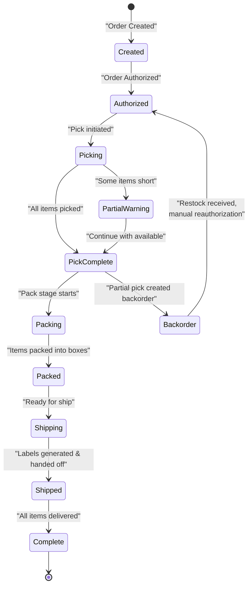
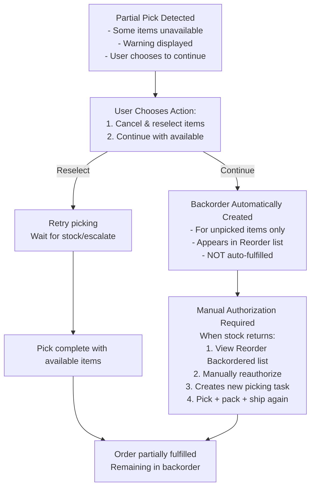

# DEAR/Cin7 Pick/Pack Workflow - Three-Stage Sequential Process

```mermaid
flowchart TD
    Start([Sales Order Created]) --> Authorize["Step 0: Sales Order Authorization<br/>Order authorized in system<br/>Items allocated/reserved<br/>Order ready for picking"]

    Authorize --> PickStage["STAGE 1: PICK<br/>Formal, mandatory stage"]

    %% PICK STAGE
    subgraph PickPhase["STAGE 1: PICK WORKFLOW"]
        PickStage --> P1["Users access WMS<br/>Web portal or mobile app<br/>Search for order by:<br/>- Order number<br/>- Scan UPC code"]

        P1 --> P2{Picking Method}

        P2 -->|Option A| Directed["🎯 Directed Pick<br/>Specific bin groups<br/>System guides route<br/>Optimized sequence"]

        P2 -->|Option B| FreeForm["🆓 Free-Form Pick<br/>Operator chooses<br/>sequence/location<br/>Manual navigation"]

        Directed --> P3
        FreeForm --> P3

        P3["For Each Line Item:<br/>- Scan barcode OR enter SKU<br/>- Confirm/adjust quantity<br/>- Can perform partial picks<br/>- Use 'Pick partially' action"]

        P3 --> Decision1{All items<br/>picked?}

        Decision1 -->|Yes| PickFinish["✅ Finish Picking<br/>All items picked<br/>Move to Pack stage"]

        Decision1 -->|No - Partial pick| PartialAlert["⚠️ Partial Pick Alert<br/>Some items unavailable<br/>Display warning on completion"]

        PartialAlert --> Decision2{Proceed or<br/>Reselect?}

        Decision2 -->|Cancel & reselect| P3
        Decision2 -->|Continue with partial| PickFinish
    end

    PickFinish --> PackStage["STAGE 2: PACK<br/>Configurable: Manual or Automatic"]

    %% PACK STAGE
    subgraph PackPhase["STAGE 2: PACK WORKFLOW"]
        PackStage --> ConfigCheck{Pack Stage<br/>Configuration}

        ConfigCheck -->|Default: Manual| Manual["Manual Packing (Default)<br/>Must be done explicitly<br/>User initiates pack"]

        ConfigCheck -->|Alternative: Automatic| Auto["Automatic Packing<br/>Auto-triggered after Pick<br/>No manual intervention needed"]

        Manual --> P4["For Each Order:<br/>- Add items to boxes/packages<br/>- Assign box numbers<br/>- Default = single box<br/>- Can create multiple boxes<br/>- Click product to assign to box"]

        Auto --> P4

        P4 --> BoxDecision{Multiple boxes<br/>needed?}

        BoxDecision -->|Single box| SingleBox["Single Box<br/>All items in one package<br/>One tracking number"]

        BoxDecision -->|Multiple boxes| MultiBox["Multiple Boxes<br/>Create separate boxes<br/>Each gets own box number<br/>Different carriers/tracking<br/>per box possible"]

        SingleBox --> PackComplete["✅ Pack Complete<br/>All items assigned<br/>Ready for shipping"]

        MultiBox --> PackComplete
    end

    PackComplete --> ShipStage["STAGE 3: SHIP<br/>Formal shipping configuration"]

    %% SHIP STAGE
    subgraph ShipPhase["STAGE 3: SHIP WORKFLOW"]
        ShipStage --> S1["Verify Shipping Details:<br/>- Ship Date<br/>- Carrier selection<br/>- Tracking Number"]

        S1 --> S2{Multiple boxes<br/>in order?}

        S2 -->|Single box| SingleShip["Single Box Ship<br/>- One carrier<br/>- One tracking number<br/>- One ship date"]

        S2 -->|Multiple boxes| MultiShip["Multiple Box Ship<br/>- Assign each box to:<br/>  * Different carrier<br/>  * Different tracking #<br/>  * Different ship date"]

        SingleShip --> S3["Generate Shipping Labels<br/>Via integrations:<br/>- EasyPost<br/>- Starshipit<br/>- Shippit<br/>- Shiptheory<br/>- ShipStation<br/>(Support varies)"]

        MultiShip --> S3

        S3 --> S4["Consolidated Shipment<br/>Support varies by integration:<br/>✅ Starshipit: YES<br/>✅ Shippit: YES<br/>❌ Shiptheory: NO<br/>❌ ShipStation: NO"]
    end

    S4 --> BackorderCheck{"Was pick<br/>partial?"}

    BackorderCheck -->|No partial picks| Complete["✅ Order Complete<br/>All items shipped"]

    BackorderCheck -->|Yes, partial pick| CreateBackorder["📋 Backorder Created<br/>Automatically created for<br/>all unpicked items<br/>Appears in<br/>Reorder Backordered list"]

    CreateBackorder --> BackorderWait["⏳ Backorder Status<br/>Backordered items<br/>DO NOT automatically<br/>trigger fulfillment<br/>Manual authorization<br/>required when<br/>stock returns"]

    Complete --> EndState([Order Fulfilled])
    BackorderWait --> EndState

    %% OPERATIONAL NOTES
    subgraph OpNotes["KEY OPERATIONAL FEATURES"]
        Note1["📦 Bin Location System<br/>- Alphanumerically sorted<br/>- Default order A1, A2, B1<br/>- Inconsistent naming<br/>breaks sort order"]

        Note2["⏱️ Time Tracking<br/>- Optional for pick/pack<br/>- Track operator productivity<br/>- Performance monitoring"]

        Note3["🔄 Multi-Location Support<br/>- Multiple warehouse<br/>locations supported<br/>- Directed pick optimization<br/>per location"]

        Note4["🔐 Mandatory Picking<br/>- Pick is formal,<br/>required step<br/>- Cannot skip<br/>- WMS-based tracking"]

        Note5["⚙️ Pack Flexibility<br/>- Configurable to automatic<br/>- Can be skipped in<br/>simplified workflows<br/>- Optional complexity"]
    end

    %% Styling
    classDef green fill:#c8e6c9,stroke:#2e7d32,color:#000
    classDef yellow fill:#fff9c4,stroke:#f57f17,color:#000
    classDef blue fill:#bbdefb,stroke:#1565c0,color:#000
    classDef process fill:#e3f2fd,stroke:#1565c0,color:#000
    classDef decision fill:#f3e5f5,stroke:#6a1b9a,color:#000
    classDef warning fill:#ffe0b2,stroke:#e65100,color:#000
    classDef phase fill:#ede7f6,stroke:#512da8,color:#000
    classDef note fill:#fce4ec,stroke:#c2185b,color:#000

    class Complete,PackComplete,PickFinish green
    class PartialAlert,CreateBackorder warning
    class Authorize,P3,P4,S1,S3 process
    class P2,Decision1,Decision2,ConfigCheck,BoxDecision,S2,BackorderCheck decision
    class PickPhase,PackPhase,ShipPhase,OpNotes phase
    class Note1,Note2,Note3,Note4,Note5 note
    class Directed,FreeForm,Manual,Auto blue
```

## Order Status Diagram

## Partial Pick & Backorder Workflow

## Key Workflow Principles

### Three Mandatory Stages:
1. **Pick**: Formal, required stage with optional picking method (directed or free-form)
2. **Pack**: Configurable (manual by default or automatic)
3. **Ship**: Shipping label generation and carrier integration

### Pick Methods:
- **Directed Pick**: System guides operator through optimized bin groups
- **Free-Form Pick**: Operator chooses sequence and location

### Partial Pick Handling:
- Warning displayed if items unavailable
- User chooses: cancel & retry or continue with available
- Automatic backorder creation for unpicked items
- Manual reauthorization required for backorders

### Pack Configuration:
- **Default**: Manual packing (explicit user action)
- **Alternative**: Automatic (triggered after pick complete)

### Multi-Box Shipping:
- Support for multiple boxes per order
- Each box can have different:
  - Carrier
  - Tracking number
  - Ship date
- Consolidated shipment support varies by integration

### Operational Assumptions:
- Formal warehouse operations
- Barcode scanning standard
- Bin location system with alphanumeric naming
- WMS-based picking workflow
- Multi-location support available
- Time tracking optional
