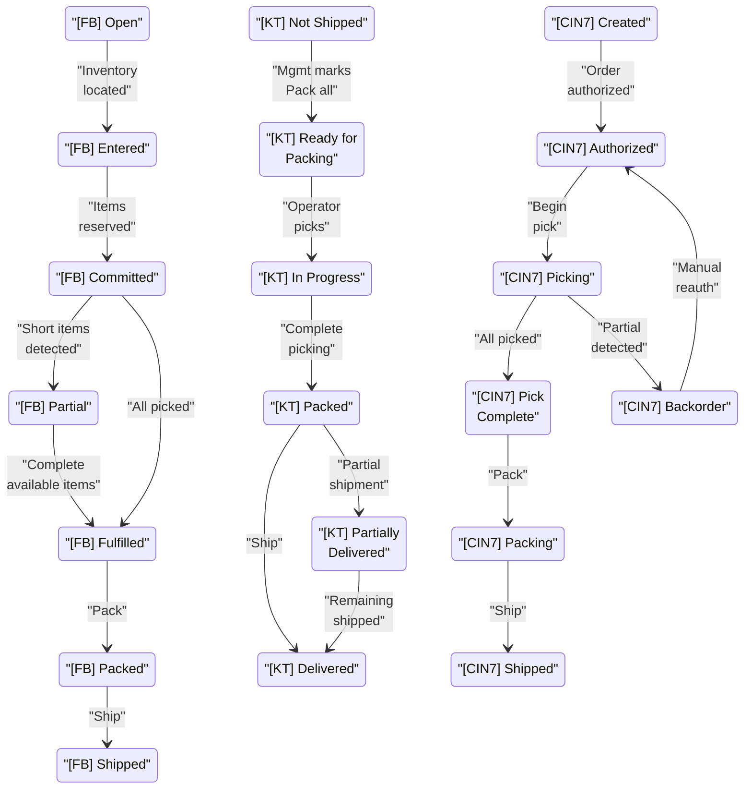
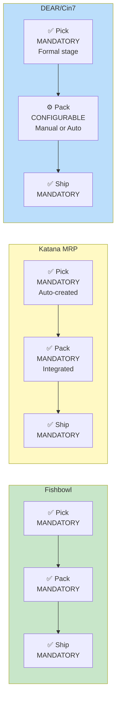

# Pick/Pack Workflow Comparison - Top 4 Competitors

## High-Level Workflow Comparison

```mermaid
flowchart LR
    subgraph FB["FISHBOWL<br/>12-Step Pick + 8-Step Pack"]
        FB1["Sales Order"] --> FB2["🟢/🟡/🔴<br/>Color-Coded<br/>Availability"]
        FB2 --> FB3["Pick Order<br/>Created"]
        FB3 --> FB4["Multi-Method<br/>Pick:<br/>Individual/<br/>Batch/Wave"]
        FB4 --> FB5["4 Status Actions:<br/>Hold/Start/<br/>Commit/Finish"]
        FB5 --> FB6["Complete<br/>Pick"]
        FB6 --> FB7["Carton<br/>Configuration"]
        FB7 --> FB8["Pack &<br/>Label"]
        FB8 --> FB9["Packing Slip<br/>Per Carton"]
        FB9 --> FB10["Generate<br/>BOL/Invoices"]
        FB10 --> FB11["Status:<br/>Packed"]
    end

    subgraph KT["KATANA MRP<br/>Mobile-First"]
        KT1["Sales Order<br/>Not Shipped"] --> KT2["Mgmt Marks<br/>Pack All"]
        KT2 --> KT3["Auto Task<br/>Assignment"]
        KT3 --> KT4["Mobile<br/>Warehouse App"]
        KT4 --> KT5["Barcode Scan<br/>OR Tap Item"]
        KT5 --> KT6["🟢 Full Pick<br/>or 🟡 Partial"]
        KT6 --> KT7["Task<br/>Complete"]
        KT7 --> KT8["Auto Packing<br/>Slip Gen"]
        KT8 --> KT9["Physical<br/>Pack"]
        KT9 --> KT10["Status:<br/>Packed"]
    end

    subgraph CIN["DEAR/CIN7<br/>3-Stage Sequential"]
        CIN1["Order<br/>Authorized"] --> CIN2["STAGE 1:<br/>PICK"]
        CIN2 --> CIN3["Directed or<br/>Free-Form<br/>Pick"]
        CIN3 --> CIN4["Partial Pick<br/>Warning"]
        CIN4 --> CIN5["STAGE 2:<br/>PACK<br/>Manual/Auto"]
        CIN5 --> CIN6["Multiple Box<br/>Support"]
        CIN6 --> CIN7["STAGE 3:<br/>SHIP"]
        CIN7 --> CIN8["Shipping<br/>Labels"]
        CIN8 --> CIN9["Auto Backorder<br/>if Partial"]
    end

    style FB fill:#c8e6c9,stroke:#2e7d32,stroke-width:2px
    style KT fill:#fff9c4,stroke:#f57f17,stroke-width:2px
    style CIN fill:#bbdefb,stroke:#1565c0,stroke-width:2px
```



## Sales Order Status Progression by Competitor



## Comparison Table: Core Characteristics

| Characteristic | Fishbowl | Katana MRP | DEAR/Cin7 |
|---|---|---|---|
| **Primary Interface** | Desktop (Windows) | Mobile (Smartphone/Tablet) | Web Portal / Mobile |
| **Pick Mandatory?** | Yes | Yes (Auto-created task) | Yes (Formal stage) |
| **Pack Mandatory?** | Yes | Yes (integrated) | Configurable (manual or auto) |
| **Pick Ticket Format** | 4"x6" thermal label | Mobile task list | WMS-based pick list |
| **Picking Method(s)** | Individual / Batch / Wave / Location-sorted | Single method (mobile task) | Directed or Free-form |
| **Pick Status States** | Hold / Start / Commit / Finish | Simple: In Progress → Complete | Simple: Picking → Complete |
| **Availability Indication** | Red/Yellow/Green color codes | Green (full) / Yellow (partial) | Warning on partial pick |
| **Barcode Scanning** | Native support (desktop + mobile) | Native (mobile camera or scanner) | Native support |
| **Batch/Serial Tracking** | Enforced (serialized items required) | Optional (Full Traceability add-on) | Optional support |
| **Carton Management** | Custom carton rules, per-carton packing slips | Simple (single box assumed) | Multiple boxes supported |
| **Partial Fulfillment** | Remains Open/Partial, manual backorder | Pack Some option, implicit backorder | Auto backorder creation |
| **Packing Slip Gen** | Per shipment or per carton | Auto-generated (sorted by bin) | Auto-generated |
| **Multi-Location Support** | Yes (wave planning) | Single/Light multi-warehouse | Yes (native) |
| **Automation Level** | Medium (batch picking efficient) | High (auto task assignment) | Medium-High (can auto-pack) |
| **Mobile Support** | Companion tool (not primary) | Primary interface | Available |
| **Document Generation** | Pick ticket, Packing slip, BOL, RMA | Packing slip | Pick list, Packing slip |
| **Workflow Flexibility** | Fixed pick→pack→ship | Fixed pick→pack→ship | Configurable stages |
| **Best For** | Manufacturing, batch picking | Small manufacturers, e-commerce | Formal warehouse ops |
| **Complexity Level** | High (months to tune) | Low (days to implement) | Medium (WMS learning curve) |

## Picking Method Comparison

### Fishbowl
```
Individual Picking
  └─ One order at a time
     └─ Simple, basic method
     └─ ~1 order per pick cycle

Batch Picking
  └─ Multiple orders simultaneously
     └─ Reduces picker travel
     └─ ~5-10 orders per cycle

Wave/Group Picking
  └─ Multiple orders in single batch
     └─ Location-sorted optimization
     └─ ~10+ orders per cycle

Location Sort Order
  └─ Route optimization
     └─ Minimizes backtracking
     └─ Warehouse layout-aware
```

### Katana MRP
```
Mobile Task-Based
  └─ One task = one SO (or grouped by mgmt)
     └─ Auto-assigned to operator
     └─ No picking method choice
     └─ Mobile workflow only
```

### DEAR/Cin7
```
Directed Pick
  └─ System guides through bin groups
     └─ Optimized sequence
     └─ Barcode verification

Free-Form Pick
  └─ Operator chooses sequence
     └─ Manual navigation
     └─ Flexible but less efficient
```

## Mandatory vs. Optional Process Comparison



## Partial Fulfillment Approach Comparison

| System | Approach | Auto/Manual | Backorder Handling |
|--------|----------|------------|-------------------|
| **Fishbowl** | Order remains PARTIAL status | Manual escalation | Manual decision: Wait / Cancel / Ship partial |
| **Katana MRP** | Pack Some option | Manual choice | Implicit backorder (remaining items tracked) |
| **DEAR/Cin7** | Backorder auto-created | Automatic | Appears in Reorder list; manual reauth when stock returns |

## Document Generation Comparison

### Pick Tickets
| System | Format | Fields | Notes |
|--------|--------|--------|-------|
| **Fishbowl** | 4"x6" thermal label | Customer, Order#, Items, Location, Barcode | Customizable via report designer |
| **Katana MRP** | Mobile task list | Order#, Items, Qty, Bin, Batch/Serial | Sorted by bin location |
| **DEAR/Cin7** | WMS pick list | Order#, SKU, Qty, Bin, Qty available | Alphanumerically sorted |

### Packing Slips
| System | Format | Distribution | Customization |
|--------|--------|---|---|
| **Fishbowl** | 8.5"x11" letter/A4 | Per shipment or per carton | Full report designer |
| **Katana MRP** | PDF | Per shipment | Basic PDF editor |
| **DEAR/Cin7** | PDF/Print | Per order/shipment | Customizable design |

## Operational Maturity Assumptions

```
Fishbowl
├─ Maturity: Medium-High
├─ Assumes:
│  ├─ Defined warehouse locations
│  ├─ Inventory accuracy > 95%
│  ├─ Barcode scanning available
│  ├─ Windows desktop environment
│  ├─ Trained warehouse staff
│  └─ Months of configuration/tuning
└─ Target: Manufacturing, wholesale distributors

Katana MRP
├─ Maturity: Low-Medium
├─ Assumes:
│  ├─ Basic warehouse discipline
│  ├─ Items in assigned bins
│  ├─ Mobile device available
│  ├─ Simple workflow OK
│  ├─ Moderate order volume
│  └─ Days to implement
└─ Target: Small manufacturers, e-commerce

DEAR/Cin7
├─ Maturity: Medium-High
├─ Assumes:
│  ├─ Formal warehouse operations
│  ├─ Barcode scanning discipline
│  ├─ Bin location system
│  ├─ WMS familiarity
│  ├─ Multi-location possible
│  └─ Weeks to implement
└─ Target: Formal warehouse ops, multi-location
```

## Key Differentiators

### Interface Philosophy
- **Fishbowl**: Desktop-first (comprehensive, powerful, dated UI)
- **Katana**: Mobile-first (simple, fast, phone-optimized)
- **Cin7**: Web-based (flexible, WMS-standard, steeper learning curve)

### Automation Level
- **Fishbowl**: Medium (batch picking efficient, manual control)
- **Katana**: High (auto task assignment, auto packing)
- **Cin7**: Medium-High (can configure automatic pack/ship)

### Flexibility
- **Fishbowl**: Rigid workflow, fixed pick→pack→ship
- **Katana**: Flexible partial picking, simple configuration
- **Cin7**: Configurable stages (manual or auto pack), directed or free-form picking

### Complexity vs. Simplicity
- **Fishbowl**: High complexity (months to dial in), powerful features
- **Katana**: Low complexity (days to setup), straightforward workflows
- **Cin7**: Medium complexity (WMS standard, learning curve required)

## Pricing Model Impact on Pick/Pack

| System | Pricing Unit | Impact on Pick/Pack |
|--------|---|---|
| **Fishbowl** | Per-user license | Encourages batch picking (leverage pickers across orders) |
| **Katana** | Per-sales-order | Penalizes high-volume, low-value (100 orders/day = high tier) |
| **Cin7** | Tiered per features | Feature gatekeeping (multi-location, WMS behind higher tiers) |

