# Fishbowl Pick/Pack Workflow - Mermaid Flowchart

## Full Pick and Pack Process (12-Step Pick + 8-Step Pack)

```mermaid
flowchart TD
    Start([Sales Order Created]) --> CheckAvail{Inventory<br/>Available?}

    %% Availability Assessment
    CheckAvail -->|Red: No items| RedStatus[Color-Coded Status: RED<br/>No items available]
    CheckAvail -->|Yellow: Some items| YellowStatus[Color-Coded Status: YELLOW<br/>Some items short]
    CheckAvail -->|Green: All items| GreenStatus[Color-Coded Status: GREEN<br/>All items in stock]

    RedStatus --> WaitStock[⏸️ Wait for Restock]
    YellowStatus --> PartialPath[📦 Continue with Partial]
    GreenStatus --> PickReady[✅ All items available]
    WaitStock --> PickReady

    %% PHASE 1: ORDER AVAILABILITY ASSESSMENT
    subgraph Phase1["PHASE 1: Order Availability Assessment"]
        CheckAvail
        RedStatus
        YellowStatus
        GreenStatus
    end

    %% PHASE 2: PICK ORDER PREPARATION
    subgraph Phase2["PHASE 2: Pick Order Preparation"]
        P4[Step 4: Pick Order Created<br/>Pick Order = READY]
        P5{Step 5: Pick Prioritization<br/>How to order picks?}
        P5A["🟢 By Due Date"]
        P5B["🟢 By Carrier"]
        P5C["🟢 By Priority Level"]
        P6{Step 6: Multi-Order<br/>Picking Options?}
        P6A["🟡 Individual Picking<br/>One order at a time"]
        P6B["🟡 Batch Picking<br/>Multiple orders together"]
        P6C["🟡 Wave/Group Picking<br/>Multiple orders in group"]
        P6D["🟡 Location Sort Order<br/>Route optimization"]
    end

    PickReady --> P4
    P4 --> P5
    P5 --> P5A & P5B & P5C
    P5A --> P6
    P5B --> P6
    P5C --> P6
    P6 --> P6A & P6B & P6C & P6D
    P6A --> ExecuteStart
    P6B --> ExecuteStart
    P6C --> ExecuteStart
    P6D --> ExecuteStart

    %% PHASE 3: PICK EXECUTION
    subgraph Phase3["PHASE 3: Pick Execution (4 Status Actions)"]
        P7["Step 7: Pick Status Options"]
        P7_HOLD["🔴 HOLD<br/>Pause pick temporarily"]
        P7_START["🟡 START<br/>Begin pick, mark in-progress"]
        P7_COMMIT["🟡 COMMIT<br/>Reserve items for customer"]
        P7_FINISH["🟢 FINISH<br/>Complete pick"]

        ExecuteStart["Step 8: Start Pick<br/>Pick Status = STARTED<br/>Warehouse staff view items:<br/>- SKU, Part#, Qty needed<br/>- Stocking location, Bin/shelf<br/>- Serial/Lot/Expiration"]

        ItemSelect["Step 9: Item Selection<br/>Items display as ENTERED<br/>Serialized items: Must select serial<br/>Lot items: Pre-select or assign"]

        PartialCheck{Step 10:<br/>Partial Pick<br/>Handling}
        PartialYes["🔴 Short Items Found<br/>Items marked SHORT<br/>Order remains PARTIAL"]
        PartialNo["🟢 All items available<br/>Ready to finish"]

        FinishPick["Step 11: Finish Pick<br/>Click FINISH<br/>All ENTERED items picked<br/>Serial dialog displays<br/>Inventory moves to<br/>packing location"]
    end

    P6A --> P7
    P6B --> P7
    P6C --> P7
    P6D --> P7
    P7 --> P7_HOLD & P7_START & P7_COMMIT & P7_FINISH
    P7_HOLD --> Holdup["⏸️ Pick On Hold<br/>Resume later"]
    P7_START --> ExecuteStart
    P7_COMMIT --> ItemSelect
    P7_FINISH --> ItemSelect

    ExecuteStart --> ItemSelect
    ItemSelect --> PartialCheck
    PartialCheck -->|Some items short| PartialYes
    PartialCheck -->|All available| PartialNo
    PartialYes --> FinishPick
    PartialNo --> FinishPick
    Holdup --> PartialCheck

    %% PHASE 4: PICK COMPLETION
    subgraph Phase4["PHASE 4: Pick Completion"]
        P12["Step 12: Pick Order Fulfilled<br/>All picked items recorded<br/>Stocking location qty ↓<br/>Packing location qty ↑<br/>Pick Status = COMPLETED<br/>Order eligible for packing"]
        NextPack{Is pick<br/>complete?}
        PartialWait["⏳ Order remains OPEN<br/>Waiting for backorder items"]
        PackReady["✅ Proceed to Packing"]
    end

    FinishPick --> P12
    P12 --> NextPack
    NextPack -->|Partial pick| PartialWait
    NextPack -->|Full pick| PackReady
    PartialWait -.->|When stock arrives| PickReady

    %% PACKING PHASE
    PackReady --> PK1["PHASE 1: Pack Preparation<br/>Step 1: Picked Items Available<br/>Items now in packing location<br/>Packing list available<br/>Carton configuration prepared"]

    PK1 --> PK2["Step 2: Carton Configuration<br/>Specify number of boxes<br/>Assign items to cartons<br/>Organize by:<br/>- Product size<br/>- Destination<br/>- Weight distribution<br/>- Custom carton rules"]

    PK2 --> PK3_PHASE["PHASE 2: Pack Execution"]

    subgraph PackPhase["PACKING PHASE 2 & 3: Execution & Slip Generation"]
        PK3["Step 3: Pack Items<br/>Confirm items match pick<br/>Place in designated cartons<br/>Verify quantities"]
        PK4["Step 4: Carton Labeling<br/>Generate carton labels:<br/>- Carton number<br/>- Contents summary<br/>- Item descriptions & qty<br/>- Weight (if applicable)<br/>- Tracking info"]
        PK5["Step 5: Packing Slip Create<br/>System generates packing slip<br/>Options:<br/>- One per shipment<br/>- OR One per carton"]
        PK5_PRINT["Step 5A: Print by Carton<br/>Separate slip per box<br/>Shows specific carton contents<br/>Box tracking number"]
        PK6["Step 6: Packing Slip Contents<br/>- Customer & address<br/>- Order number<br/>- Order date<br/>- Carton number (if applicable)<br/>- Item listing<br/>- SKU, Description, Qty<br/>- UOM, Special instructions"]
    end

    PK3_PHASE --> PK3 --> PK4 --> PK5
    PK5 --> PK5_PRINT & PK6

    PK6 --> PK7["PHASE 4: Shipment Prep<br/>Step 7: Additional Docs<br/>- Bill of Lading (BOL)<br/>- Commercial Invoices<br/>- RMA slips (if applicable)"]

    PK7 --> PK8["Step 8: Pack Complete<br/>Order status = PACKED<br/>Cartons labeled & documented<br/>Packing slips attached<br/>Ready for shipping"]

    PK8 --> EndState([Order Ready for Shipping])

    %% Styling
    classDef green fill:#c8e6c9,stroke:#2e7d32,color:#000
    classDef yellow fill:#fff9c4,stroke:#f57f17,color:#000
    classDef red fill:#ffcdd2,stroke:#c62828,color:#000
    classDef process fill:#e3f2fd,stroke:#1565c0,color:#000
    classDef decision fill:#f3e5f5,stroke:#6a1b9a,color:#000
    classDef phase fill:#ede7f6,stroke:#512da8,color:#000

    class PackReady,PK8,GreenStatus,PartialNo green
    class P5A,P5B,P5C,P5,P6,P7,P7_START,P7_COMMIT yellow
    class P7_HOLD,P7_FINISH,RedStatus red
    class ExecuteStart,ItemSelect,P4,P12,FinishPick,PK1,PK2,PK3,PK4,PK5,PK6,PK7,PK8 process
    class PartialCheck,NextPack,CheckAvail decision
    class Phase1,Phase2,Phase3,Phase4,PackPhase phase
```

## Key Features Highlighted:

### Color-Coded Availability States:
- **🔴 Red**: No items available
- **🟡 Yellow**: Some items short
- **🟢 Green**: All items in stock

### 4 Pick Status Options:
- **HOLD**: Temporarily pause
- **START**: Begin picking (in-progress)
- **COMMIT**: Reserve items for customer
- **FINISH**: Complete the pick

### Picking Method Options:
- Individual Picking (basic)
- Batch Picking (multiple orders simultaneously)
- Wave/Group Picking (multiple orders in single batch)
- Location Sort Order (route optimization)

### Handling Partial Picks:
- Short items marked as SHORT
- Order remains in PARTIAL status
- Option to complete available items, wait for backorder, or escalate

### Packing Components:
- Carton configuration and labeling
- Packing slip options (per shipment or per carton)
- Additional documents (BOL, commercial invoices, RMA slips)
