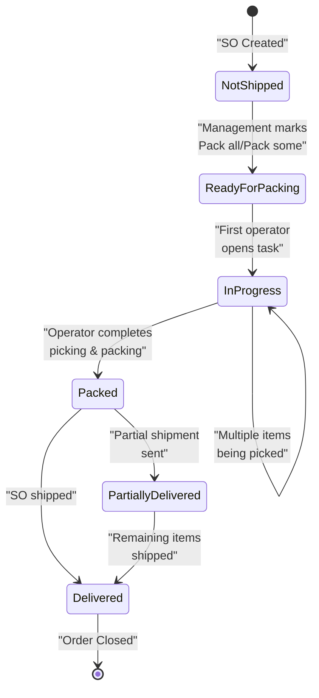

# Katana MRP Pick/Pack Workflow - Mobile-First Picking

```mermaid
flowchart TD
    Start([Sales Order Created]) --> SOStatus["Sales Order Status:<br/>NOT SHIPPED<br/>Items committed but<br/>not yet physically picked"]

    SOStatus --> Decision1{Ready to Pack?}

    Decision1 -->|Management marks<br/>Pack all or Pack some| Signal["🔔 Signal Management<br/>Mark SO row status:<br/>- Pack all<br/>- Pack some..."]

    Signal --> AutoTask["✅ Automatic Task<br/>Creation & Assignment<br/>System generates<br/>picking task<br/>Task assigned to first<br/>operator who starts it"]

    AutoTask --> TaskStatus["Task Status:<br/>READY FOR PACKING<br/>SO status advances to<br/>READY FOR PACKING"]

    %% PICKING WORKFLOW
    subgraph PickingPhase["PICKING WORKFLOW: Mobile Warehouse App"]
        TaskStatus --> Step2["Step 2: Task Assignment<br/>- Auto-assigned to operator<br/>- No manual assignment needed<br/>- Based on SO priority order<br/>- Operator can override priority"]

        Step2 --> Step3["Step 3: Operator Receives Task<br/>Warehouse App displays:<br/>- Order ID<br/>- Customer name<br/>- Item list with required qty<br/>- Delivery deadline<br/>- Batch/serial numbers<br/>- Default bin locations"]

        Step3 --> Step4["Step 4: Locating Items<br/>Operator navigates to<br/>storage location<br/>- Guided by bin location<br/>- Or manual search<br/>- System integrates with<br/>warehouse layout"]

        Step4 --> Step5["Step 5: Scanning & Selection<br/>Operator taps item OR<br/>scans item barcode<br/>Item detail view opens:<br/>- Product name & SKU<br/>- Required quantity<br/>- Batch/serial options<br/>- Current picked quantity"]

        Step5 --> Step6{Step 6: Quantity<br/>Verification}

        Step6 -->|Full qty picked| Green["🟢 Full Pick<br/>Item shows in GREEN<br/>Full quantity recorded"]

        Step6 -->|Partial qty picked| Yellow["🟡 Partial Pick<br/>Item shows in YELLOW<br/>System allows shortfall"]

        Green --> Complete["Quantity Confirmed<br/>Item added to picks list"]
        Yellow --> Complete

        Complete --> MoreItems{All items<br/>picked?}

        MoreItems -->|No, continue| Step5
        MoreItems -->|Yes, all picked| Step7["Step 7: Task Completion<br/>Operator marks task complete<br/>Task moves to<br/>Completed tasks list<br/>Inventory adjustments applied"]
    end

    Decision1 -->|No, order not ready| HoldOrder["⏸️ Order Remains<br/>NOT SHIPPED Status"]
    HoldOrder -.->|When ready| Decision1

    Step7 --> SOUpdate["SO Status Update:<br/>NOT SHIPPED → PACKED<br/>Inventory marked as<br/>picked and packed<br/>Order ready for shipment"]

    %% PACKING WORKFLOW
    subgraph PackingPhase["PACKING WORKFLOW: Post-Pick"]
        SOUpdate --> Pack1["Packing Decision<br/>After picking complete:<br/>- Immediately pack<br/>- OR use separate<br/>packing task<br/>(if configured)"]

        Pack1 --> Pack2["Packing Slip Generation<br/>System generates packing slip:<br/>- Sales Order number<br/>- Customer name<br/>- List of picked items<br/>- Quantities for each<br/>- Delivery deadline<br/>- Batch/serial numbers<br/>- Storage bin info<br/>- Sorted by bin location"]

        Pack2 --> Pack3{Pack All or<br/>Pack Some?}

        Pack3 -->|Full packing| PackAll["Pack All<br/>Mark entire SO packed<br/>All items fulfilled"]

        Pack3 -->|Partial packing| PackSome["Pack Some<br/>Partial packing<br/>Some items unavailable<br/>Useful for backorders"]

        PackAll --> Physical["Physical Packing<br/>Warehouse team:<br/>- Physically packs items<br/>- Uses packing slip as guide<br/>- Cross-references picked items<br/>- Confirms batch/serial match"]

        PackSome --> Physical

        Physical --> Confirm["Packing Confirmation<br/>Mark order status:<br/>- Packed (full)<br/>- Partially packed (partial)"]

        Confirm --> ReadyShip["Order Status:<br/>PACKED<br/>Ready for shipping<br/>Triggers downstream<br/>shipping integration"]
    end

    ReadyShip --> EndState([Order Ready for Fulfillment])

    %% UX NOTES
    subgraph UXNotes["KEY UX FEATURES: Mobile-First Design"]
        Note1["📱 Mobile-Centric<br/>- Warehouse App primary<br/>- Smartphone/tablet focused<br/>- Built for warehouse floor<br/>- Paper-free workflows"]

        Note2["🎯 Auto Task Assignment<br/>- First operator to open<br/>task owns it<br/>- Reduces management overhead<br/>- Priority ordering built-in<br/>- Simple task list view"]

        Note3["📸 Barcode Scanning<br/>- Tap camera icon<br/>- Device camera opens<br/>- Scan barcode → item opens<br/>- All USB/Bluetooth scanners<br/>supported"]

        Note4["⚡ Picking Speed<br/>- Tap to open (known items)<br/>- Scan for validation<br/>- Live progress indicator<br/>- Items show green/yellow<br/>- One-tap completion"]

        Note5["📊 Real-Time Status<br/>- Live picking progress<br/>- Item status visible<br/>- Green = fully picked<br/>- Yellow = partially picked<br/>- Inventory committed in real-time"]
    end

    %% Styling
    classDef green fill:#c8e6c9,stroke:#2e7d32,color:#000
    classDef yellow fill:#fff9c4,stroke:#f57f17,color:#000
    classDef process fill:#e3f2fd,stroke:#1565c0,color:#000
    classDef decision fill:#f3e5f5,stroke:#6a1b9a,color:#000
    classDef mobile fill:#f0f4c3,stroke:#827717,color:#000
    classDef phase fill:#ede7f6,stroke:#512da8,color:#000
    classDef note fill:#fce4ec,stroke:#c2185b,color:#000

    class Green,ReadyShip,PackAll,SOUpdate green
    class Yellow,Pack3 yellow
    class AutoTask,Step2,Step3,Step4,Step5,Step7,Pack1,Pack2,Physical,Confirm process
    class Decision1,Step6,MoreItems,Pack3 decision
    class SOStatus,TaskStatus note
    class PickingPhase,PackingPhase,UXNotes phase
    class Note1,Note2,Note3,Note4,Note5 note
```

## Sales Order Status Progression

## Key Workflow Characteristics

### Mobile-First Approach:
- **Warehouse App**: Primary interface for operators
- **Phone/Tablet Optimized**: Built for warehouse floor usage
- **Barcode Scanning**: Camera or scanner integration
- **Paper-Free**: All picking on mobile device

### Automatic Task Assignment:
- First operator to open task owns it
- No manual assignment overhead
- Priority ordering built-in
- Can override priority if needed

### Flexible Partial Picking:
- Yellow indicators for short picks
- System allows partial quantities
- "Pack all" vs "Pack some" options
- Natural backorder handling

### Pick/Pack Integration:
- Picking happens first (mobile task)
- Packing slip generated automatically
- Can pack immediately after picking
- Or use separate packing task if needed

### Status Indicators:
- **Green**: Item fully picked
- **Yellow**: Item partially picked
- **Real-time feedback**: Progress visible immediately
- **Automatic inventory adjustments**: Applied on task completion

### Hardware Flexibility:
- Mobile device camera for scanning
- USB/Bluetooth scanners supported
- Standard barcode integration
- Minimal hardware cost

### Batch/Serial Tracking:
- Batch number selection during picking
- Serial number confirmation
- Expiry date visibility
- Full traceability to customer
