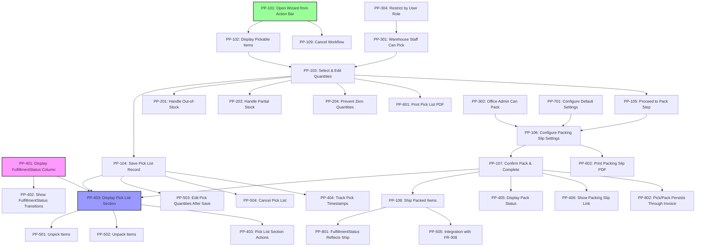

# User Stories — Pick/Pack Feature (MVP)
**Date:** March 28, 2026
**Mode:** 4 — User Story Generation
**Feature:** Pick & Pack Wizard + Persistent Tracking (Combined MVP)
**Tech Stack:** React / Next.js / TypeScript, shadcn/ui, Tailwind CSS

---

## Story Summary Table

| ID | Title | Category | Priority | Estimate | Dependencies |
|-----|-------|----------|----------|----------|--------------|
| PP-101 | Open Pick & Pack Wizard from Action Bar | 1. Core Operational Flow | Must have | S | — |
| PP-102 | Display Pickable Items with Stock Indicators | 1. Core Operational Flow | Must have | M | PP-101 |
| PP-103 | Select & Edit Quantities to Pick (Step 1) | 1. Core Operational Flow | Must have | M | PP-102 |
| PP-104 | Save Pick List Record to Database | 1. Core Operational Flow | Must have | M | PP-103 |
| PP-105 | Proceed to Pack Step (Step 2) | 1. Core Operational Flow | Must have | M | PP-103 |
| PP-106 | Configure Packing Slip Settings | 1. Core Operational Flow | Must have | S | PP-105 |
| PP-107 | Confirm Pack & Complete Fulfillment | 1. Core Operational Flow | Must have | M | PP-106 |
| PP-108 | Ship Packed Items via Existing Ship Flow | 1. Core Operational Flow | Must have | M | PP-107 |
| PP-109 | Cancel Pick & Pack Workflow | 1. Core Operational Flow | Must have | S | PP-101 |
| PP-201 | Handle Out-of-Stock Items | 2. Exception & Error Handling | Must have | M | PP-102 |
| PP-202 | Handle Partial Stock Availability | 2. Exception & Error Handling | Must have | M | PP-102 |
| PP-203 | Alert User if Inventory Changes During Pick | 2. Exception & Error Handling | Should have | M | PP-104 |
| PP-204 | Prevent Zero-Quantity Picks | 2. Exception & Error Handling | Must have | S | PP-103 |
| PP-205 | Handle Items Added/Removed from Order | 2. Exception & Error Handling | Should have | M | PP-101 |
| PP-301 | Warehouse Staff Can Pick Items | 3. Role & Permission Behavior | Must have | M | PP-103 |
| PP-302 | Office Admin Can Pack Items | 3. Role & Permission Behavior | Must have | S | PP-106 |
| PP-303 | Business Owner Can View All Fulfillment Status | 3. Role & Permission Behavior | Should have | S | PP-401 |
| PP-304 | Restrict Pick/Pack Actions by User Role | 3. Role & Permission Behavior | Should have | M | PP-301 |
| PP-401 | Display FulfillmentStatus Column on List Screen | 4. State Communication & Audit | Must have | M | — |
| PP-402 | Show FulfillmentStatus Transitions on SO Screen | 4. State Communication & Audit | Must have | S | PP-401 |
| PP-403 | Display Pick List Section on SO Screen | 4. State Communication & Audit | Must have | M | PP-104 |
| PP-404 | Track Pick Timestamps & User Attribution | 4. State Communication & Audit | Should have | M | PP-104 |
| PP-405 | Display Pack Status in Pick List Section | 4. State Communication & Audit | Must have | S | PP-403 |
| PP-406 | Show Packing Slip PDF Link in Pick List Section | 4. State Communication & Audit | Should have | M | PP-107 |
| PP-501 | Unpick Items (Reverse to "Items Not Shipped") | 5. Recovery & Edit Behavior | Must have | M | PP-403 |
| PP-502 | Unpack Items (Reverse Packed to Picked) | 5. Recovery & Edit Behavior | Must have | M | PP-403 |
| PP-503 | Edit Pick Quantities After Save | 5. Recovery & Edit Behavior | Should have | M | PP-104 |
| PP-504 | Cancel Pick List Entirely | 5. Recovery & Edit Behavior | Should have | M | PP-104 |
| PP-505 | Integration with FR-308 (Undo Shipment) | 5. Recovery & Edit Behavior | Must have | S | PP-108 |
| PP-601 | Print Pick List PDF (Step 1) | 1. Core Operational Flow | Must have | M | PP-103 |
| PP-602 | Print Packing Slip PDF (Step 2) | 1. Core Operational Flow | Must have | M | PP-106 |
| PP-603 | Reprint Pick List from Pick List Section | 6. Bulk & High-Volume Usage | Should have | S | PP-403 |
| PP-604 | Keyboard Shortcuts for Modal Navigation | 6. Bulk & High-Volume Usage | Nice to have | M | PP-101 |
| PP-605 | Batch Process Multiple Orders (Phase 2 note) | 6. Bulk & High-Volume Usage | Nice to have | L | PP-101 |
| PP-701 | Configure Default Packing Slip Settings | 7. Configuration & Admin | Should have | S | — |
| PP-702 | Configure FulfillmentStatus Column Visibility | 7. Configuration & Admin | Nice to have | S | PP-401 |
| PP-703 | Set Up Pick List PDF Template | 7. Configuration & Admin | Nice to have | L | PP-601 |
| PP-801 | FulfillmentStatus Reflects Ship Status | 8. Ecosystem Connections | Must have | S | PP-107, PP-108 |
| PP-802 | Pick/Pack Data Persists Through Invoice Creation | 8. Ecosystem Connections | Must have | M | PP-107 |
| PP-803 | Document Pick/Pack for QB Sync (Future) | 8. Ecosystem Connections | Nice to have | S | PP-404 |
| PP-804 | Clear Pick List on Order Cancellation | 8. Ecosystem Connections | Should have | M | PP-104 |

---

## Story Dependency Map



---

## Category 1: Core Operational Flow

### Story PP-101: Open Pick & Pack Wizard from Action Bar
**As a** warehouse staff member,
**I want to** click a "Pick & Pack" button on the Sales Order screen to open the fulfillment wizard,
**So that** I can begin the picking and packing workflow without navigating away from the order.

**Acceptance Criteria:**
- [ ] Given a Sales Order in "Open" or "Partially Shipped" status, when I navigate to the SO detail screen, then a "Pick & Pack" button is visible in the action bar (between "Send" and "Ship" buttons)
- [ ] Given the "Pick & Pack" button, when I click it, then the Pick & Pack wizard modal opens (Step 1: Pick)
- [ ] Given the wizard modal is open, when I view the modal header, then it displays "Pick & Pack (1/2)" with a step indicator
- [ ] Given the wizard is open, when I close the modal via Cancel or the X button, then I return to the Sales Order detail screen without saving any changes
- [ ] Given the button state, when the order is already "Fully Shipped," then the "Pick & Pack" button is disabled with a tooltip "Order is fully shipped"

**Technical Notes:**
- Add new `PickPackButton` component to `SalesOrderScreen` action bar
- Modal should use existing `Modal` / `Dialog` component from shadcn/ui
- Reuse `ProgressIndicator` component for Step 1/2 display (similar to existing wizard patterns)
- Button placement in action bar: `[More Actions ▼] [Create ▼] [Send ▼] [Pick & Pack] [Ship ▼] [Save ▼]`
- Modal size: 870px width per spec

**Dependencies:** —
**Estimate:** S
**Priority:** Must have

---

### Story PP-102: Display Pickable Items with Stock Indicators
**As a** warehouse staff member,
**I want to** see all items in the sales order with their current location, available quantity, and stock status indicators,
**So that** I can quickly understand what needs to be picked and where potential shortages exist.

**Acceptance Criteria:**
- [ ] Given the Pick step (Step 1) is open, when I view the modal, then a table displays: Item, Location, Qty Available, Qty to Pick (editable column)
- [ ] Given each row, when I view the "Qty Available" column, then it shows the available inventory at that location (from the SO's LineItem.availableQty)
- [ ] Given the Qty Available value, when it equals or exceeds the order qty, then a green stock indicator (●) appears before the item name
- [ ] Given the Qty Available value, when it is less than order qty but greater than zero, then a yellow stock indicator (●) appears, indicating partial availability
- [ ] Given the Qty Available value, when it is zero, then a red stock indicator (●) appears, indicating out-of-stock
- [ ] Given the table, when I scroll down and there are many items, then the table supports scrolling within the modal (max height ~400px, scrollable body)
- [ ] Given the table header, when I view it, then it includes "Select All" and "Deselect All" checkboxes to toggle row selection
- [ ] Given each item row, when I view it, then a checkbox on the left allows individual item selection

**Technical Notes:**
- Reuse `ItemsTable` component from existing SO screen, extend with stock indicators
- Add new column: stock status indicator as a React component (`StockIndicator` with green/yellow/red logic)
- Qty Available should derive from: `LineItem.availableQty` (already in SalesOrder type)
- Implement "Select All" / "Deselect All" toggle in table header (standard pattern)
- Table columns: [Checkbox] [Item Name] [Location] [Qty Available] [Qty to Pick]
- Use Tailwind classes for color indicators (bg-green-100, bg-yellow-100, bg-red-100)

**Dependencies:** PP-101
**Estimate:** M
**Priority:** Must have

---

### Story PP-103: Select & Edit Quantities to Pick (Step 1)
**As a** warehouse staff member,
**I want to** edit the "Qty to Pick" field for each item and confirm my selections,
**So that** I can specify how much of each item to pick (full qty or partial if stock is limited).

**Acceptance Criteria:**
- [ ] Given the "Qty to Pick" column, when I click on a cell, then it becomes editable (text input, focused)
- [ ] Given an editable cell, when I type a number, then only positive integers are allowed (0-9)
- [ ] Given a quantity field, when I blur or press Enter, then the value is validated: must be ≤ Qty Available and > 0 (see PP-204)
- [ ] Given the Qty to Pick field, when I enter a quantity greater than Qty Available, then an inline error appears: "Cannot exceed available quantity"
- [ ] Given selected items, when I click "Save Pick List" button in Step 1, then all rows with Qty to Pick > 0 are included in the saved pick list
- [ ] Given the Step 1 buttons, when I view the modal footer, then three buttons are present: "Save Pick List" (primary), "Next →" (secondary), "Cancel" (tertiary)
- [ ] Given the "Next →" button, when I click it without selecting any items, then a warning appears: "Please select at least one item to pick"
- [ ] Given the "Next →" button, when I click it with valid selections, then the modal advances to Step 2 (Pack)

**Technical Notes:**
- Qty to Pick field is a controlled input using React state (store in component state during modal lifecycle)
- Validation on blur and on Next button click
- Use shadcn/ui `Input` component for editable cells
- Use `FormError` component for inline validation messages (existing pattern)
- Implement "Select All" logic to auto-fill Qty to Pick with Qty Available for all items (nice to have enhancement)
- Button placement at modal footer: [Cancel] [Save Pick List] [Next →]

**Dependencies:** PP-102
**Estimate:** M
**Priority:** Must have

---

### Story PP-104: Save Pick List Record to Database
**As a** warehouse staff member,
**I want to** save my pick selections when I click "Save Pick List,"
**So that** the system records what was picked, who picked it, and when, enabling me to resume picking later or reprint the pick list.

**Acceptance Criteria:**
- [ ] Given the "Save Pick List" button in Step 1, when I click it with valid item selections, then a PickList record is created and saved to the database
- [ ] Given the saved PickList record, when I view it, then it contains: orderId, pickListNumber, items (with itemId, qty, location), createdAt, createdBy (user ID), status ("Pending" initially)
- [ ] Given the PickList record, when it is saved, then the FulfillmentStatus on the parent SO transitions from "Not Started" to "Pick in Progress"
- [ ] Given a saved pick list, when I close the modal (via Cancel or X button after saving), then I return to the SO screen and the new Pick List section is now populated
- [ ] Given the PickList record, when it is created, then a system message logs: "[User] started picking [Order #] at [timestamp]" (audit trail)
- [ ] Given the wizard after saving, when I click "Next →" to proceed to Pack step, then the PickList ID is referenced in the Pack step
- [ ] Given the PickList after save, when other users view the SO, then they see the Pick List section is now active with status "Pick in Progress"

**Technical Notes:**
- Create new `PickList` data type in TypeScript (optional: extend from existing schema)
- PickList interface:
  ```ts
  interface PickList {
    id: string;
    orderId: string;
    pickListNumber: string; // auto-generated, e.g., "PL-001"
    items: PickListItem[];
    status: "Pending" | "Picked" | "Packed";
    createdAt: Date;
    createdBy: string; // user ID
    notes?: string;
  }
  interface PickListItem {
    itemId: string;
    itemName: string;
    location: string;
    qtyToPick: number;
    qtyPicked?: number; // filled in via Step 1 checkbox or inline edit
  }
  ```
- API endpoint: `POST /api/pick-lists` (creates new record)
- Update SalesOrder FulfillmentStatus field: add new type value "Pick in Progress"
- Log audit trail via existing audit service (or add audit logging if not present)
- Notify team (realtime update if using WebSocket/polling)

**Dependencies:** PP-103
**Estimate:** M
**Priority:** Must have

---

### Story PP-105: Proceed to Pack Step (Step 2)
**As a** warehouse staff member,
**I want to** advance to the Pack step after selecting items to pick,
**So that** I can configure packing options and confirm the fulfillment is complete.

**Acceptance Criteria:**
- [ ] Given Step 1 with valid selections, when I click "Next →" button, then the modal transitions to Step 2 (Pack) with a smooth animation
- [ ] Given Step 2, when I view it, then the header displays "Pick & Pack (2/2)" with the step indicator updated
- [ ] Given Step 2, when it opens, then a summary table shows all picked items in read-only format: Item, Location, Qty to Pick, Status
- [ ] Given the Step 2 summary, when I view it, then each item shows a checkbox field (initially unchecked) labeled "Picked" to confirm receipt in warehouse
- [ ] Given the "Back" button in Step 2, when I click it, then I return to Step 1 with all previous selections intact
- [ ] Given Step 2 with unsaved selections, when I click Back and then Next again, then the same items are still selected (state is preserved)

**Technical Notes:**
- Step 2 should reuse the same modal container, updating content via state
- Use `useState` to track current step (1 or 2)
- Summary table is read-only (no editable Qty to Pick in Step 2)
- Add confirmation checkboxes in Step 2 for warehouse staff to confirm items are in-hand before packing
- Back button logic: decrement step, re-render Step 1 component with same state
- Modal footer: [Back] [Confirm Pack] with step indicator ● ●

**Dependencies:** PP-103
**Estimate:** M
**Priority:** Must have

---

### Story PP-106: Configure Packing Slip Settings
**As a** warehouse staff member or office admin,
**I want to** choose whether to generate a packing slip and whether to include prices,
**So that** the packing slip meets customer requirements and my business processes.

**Acceptance Criteria:**
- [ ] Given Step 2 (Pack), when I view the form, then a toggle labeled "Generate packing slip" is present and ON by default
- [ ] Given the "Generate packing slip" toggle, when it is ON, then a secondary toggle appears below: "Show prices on packing slip" (OFF by default)
- [ ] Given the "Show prices on packing slip" toggle, when I toggle it ON, then the packing slip PDF will include unit rate and amount columns
- [ ] Given the toggle OFF, when I view the form, then those columns are hidden in the packing slip output
- [ ] Given the packing slip section, when I view it, then an optional text field "Packing notes" allows me to add custom notes (e.g., "Handle with care")
- [ ] Given packing notes, when I enter text, then it is stored and will appear on the printed packing slip
- [ ] Given the toggles, when they are saved via "Confirm Pack," then the preferences are reflected in the generated PDF

**Technical Notes:**
- Use shadcn/ui `Toggle` or `Checkbox` component for toggles
- Packing slip settings stored in PickList record as:
  ```ts
  interface PickListPackingConfig {
    generatePackingSlip: boolean; // default true
    showPricesOnSlip: boolean; // default false
    packingNotes?: string;
  }
  ```
- Conditional rendering: secondary toggle only shows if "Generate packing slip" is true
- Text field for notes: standard `Textarea` input, max 500 chars
- Store these settings on the PickList record for audit and reprinting

**Dependencies:** PP-105
**Estimate:** S
**Priority:** Must have

---

### Story PP-107: Confirm Pack & Complete Fulfillment
**As a** warehouse staff member,
**I want to** click "Confirm Pack" to finalize the pick and pack workflow,
**So that** the order is marked as packed and ready to ship.

**Acceptance Criteria:**
- [ ] Given Step 2 with all settings configured, when I click "Confirm Pack" button, then the PickList record is updated with status "Packed"
- [ ] Given the PickList, when it is updated to "Packed," then a Packing Slip PDF is generated (if "Generate packing slip" toggle is ON)
- [ ] Given the PDF generation, when it completes, then the packing slip file is stored with a reference on the PickList record
- [ ] Given the SO FulfillmentStatus, when the pack is confirmed, then it transitions from "Pick in Progress" or "Picked" to "Packed"
- [ ] Given the modal, when "Confirm Pack" is clicked, then a success message appears: "Order [#] has been packed and is ready to ship"
- [ ] Given the modal after success, when the user dismisses the message (or after 2 seconds), then the modal closes automatically
- [ ] Given the SO screen, when I return from the modal, then the Pick List section now shows status "Packed" with updated timestamps

**Technical Notes:**
- "Confirm Pack" button is the primary action in Step 2 footer
- API call: `PATCH /api/pick-lists/{pickListId}` with status = "Packed"
- Trigger PDF generation via `generatePackingSlip()` function (see PP-602 for PDF logic)
- Update SalesOrder.fulfillmentStatus = "Packed"
- On success, use toast notification (shadcn/ui `Toast` component) or in-modal success message
- Modal closes via `setTimeout(() => closeModal(), 2000)` after showing success message
- Return focus to SO screen, which re-fetches and displays updated Pick List section

**Dependencies:** PP-106
**Estimate:** M
**Priority:** Must have

---

### Story PP-108: Ship Packed Items via Existing Ship Flow
**As a** warehouse staff member or office admin,
**I want to** ship items that have been picked and packed using the existing Ship flow,
**So that** the order moves from "Packed" to "Shipped" status and inventory is fully accounted for.

**Acceptance Criteria:**
- [ ] Given a Sales Order with FulfillmentStatus = "Packed," when I view the action bar, then the "Ship ▼" button is available
- [ ] Given the "Ship ▼" dropdown, when I click it, then "Ship Some..." and "Ship All" options appear (existing Ship flow, unchanged)
- [ ] Given "Ship All," when I click it, then the existing SelectShippedItemsModal opens, pre-populated with all picked and packed items
- [ ] Given the Ship modal, when I confirm, then shipped quantities are recorded in ShippedItem records and OrderStatus transitions to "Fully Shipped"
- [ ] Given the SO FulfillmentStatus, when the shipment is completed, then it transitions to "Shipped"
- [ ] Given the "Items shipped" table, when items are shipped, then they appear in the existing "Items shipped" section (unchanged)
- [ ] Given the Pick List section, when items are shipped, then those items' status is updated to reflect "Shipped"

**Technical Notes:**
- No changes to existing `SelectShippedItemsModal` component
- Integrate with existing Ship flow: `handleShip()` function and `ShippedItem` records
- Pre-populate Ship modal with items from PickList where status = "Packed"
- After shipment, update SO.fulfillmentStatus = "Shipped"
- Maintain existing "Items shipped" table behavior and Undo button (FR-308)
- When items are shipped, PickList items should reference shipped quantities for audit trail

**Dependencies:** PP-107
**Estimate:** M
**Priority:** Must have

---

### Story PP-109: Cancel Pick & Pack Workflow
**As a** warehouse staff member,
**I want to** close the Pick & Pack wizard at any time without saving,
**So that** I can abandon the workflow if I realize I've started the wrong order or need to handle an urgent interruption.

**Acceptance Criteria:**
- [ ] Given the Pick & Pack wizard (Step 1 or Step 2), when I click the "Cancel" button or X icon, then a confirmation dialog appears (if changes were made)
- [ ] Given no changes in Step 1, when I click Cancel, then the modal closes immediately without confirmation
- [ ] Given changes in Step 1 (items selected, quantities edited), when I click Cancel, then the confirmation asks: "Discard pick list? Changes will not be saved."
- [ ] Given the confirmation, when I click "Discard," then the modal closes and no PickList record is created
- [ ] Given the confirmation, when I click "Continue picking," then the confirmation dialog closes and the wizard remains open
- [ ] Given the modal after Step 1 is saved, when I click Cancel in Step 2, then the confirmation asks: "Return to Sales Order? The pick list will remain saved."
- [ ] Given the confirmation in Step 2, when I click "Return to SO," then the modal closes, the PickList remains in the database with status "Pending," and I return to the SO screen

**Technical Notes:**
- Implement unsaved changes tracking via React state flag
- Use confirmation dialog component from shadcn/ui (e.g., `AlertDialog`)
- Distinguish two scenarios: (1) Cancel in Step 1 before save, (2) Cancel in Step 2 after save
- If PickList is saved, it stays in database even if user cancels Step 2 (user can resume via "Pack" button in Pick List section)
- Return to SO screen via modal `onClose` callback

**Dependencies:** PP-101
**Estimate:** S
**Priority:** Must have

---

### Story PP-601: Print Pick List PDF (Step 1)
**As a** warehouse staff member,
**I want to** print a pick list document from Step 1 of the wizard,
**So that** I have a physical or digital reference while picking items from the shelves.

**Acceptance Criteria:**
- [ ] Given Step 1 (Pick), when I view the modal footer, then a "Print Pick List" button is present (secondary action)
- [ ] Given the "Print Pick List" button, when I click it, then a PDF is generated with the current selection (items with Qty to Pick > 0)
- [ ] Given the generated PDF, when I view it, then it contains: Order number, Customer name, Ship-to address, Items table with columns: Location, Item, Qty to Pick, [Checkbox for picked]
- [ ] Given the PDF table, when items are grouped, then they are sorted by Location to optimize warehouse pick path
- [ ] Given the PDF, when I view the footer, then it includes a signature line: "Picked by: __________ Date: __________"
- [ ] Given the PDF generation, when it completes, then it is automatically downloaded or opens in a new tab (browser default)
- [ ] Given the PDF, when I view the modal again, then I can print it again without losing modal state

**Technical Notes:**
- Use a PDF library like `pdfkit` or `jsPDF` + `html2canvas` for client-side PDF generation
- Pick List PDF template structure:
  ```
  [Company Logo / Header]
  Pick List
  Order #: [OrderNumber]
  Customer: [CustomerName]
  Ship-to Address:
  [Address]
  ────────────────────
  Location | Item | Qty to Pick | ☐
  ────────────────────
  [Picked by: ________] [Date: __________]
  ```
- Group items by Location (existing location data from LineItem.sourceLocationName)
- Button placement: "Print Pick List" appears next to "Save Pick List" / "Next →" buttons
- PDF filename: `PickList-{OrderNumber}-{Date}.pdf`
- Use shadcn/ui `Button` with print icon

**Dependencies:** PP-103
**Estimate:** M
**Priority:** Must have

---

### Story PP-602: Print Packing Slip PDF (Step 2)
**As a** warehouse staff member or office admin,
**I want to** print a packing slip document from Step 2 of the wizard,
**So that** I have a document to include in the shipment with pricing/notes as configured.

**Acceptance Criteria:**
- [ ] Given Step 2 (Pack) with "Generate packing slip" toggle ON, when I click "Confirm Pack," then a Packing Slip PDF is automatically generated
- [ ] Given the Packing Slip PDF, when I view it, then it contains: Ship-to address, Ship-from address, Items table with: Item, Qty, [Unit Rate (if toggled ON)], [Amount (if toggled ON)]
- [ ] Given the "Show prices on packing slip" toggle OFF, when the PDF is generated, then the Unit Rate and Amount columns are omitted
- [ ] Given the packing notes field, when notes are entered, then they appear in the PDF footer: "Notes: [text]"
- [ ] Given the PDF, when it is generated, then it is available for download or immediate viewing
- [ ] Given the Pick List section on SO screen, when I view it, then a "Download packing slip" link appears next to the pick list status
- [ ] Given the PDF filename, when it is saved, then it follows the pattern: `PackingSlip-{OrderNumber}-{Date}.pdf`

**Technical Notes:**
- Use same PDF generation library as Pick List (jsPDF or pdfkit)
- Packing Slip PDF template:
  ```
  [Company Header]
  Packing Slip
  ────────────────────
  Ship-to:               Ship-from:
  [Address]             [Company Address]
  ────────────────────
  Item | Qty | [Unit Rate] | [Amount]
  ────────────────────
  [if notes] Notes: [text]
  ────────────────────
  Thank you for your business!
  ```
- Store generated PDF reference on PickList record (filePath or blob)
- Prices pulled from LineItem.rate and LineItem.amount
- Conditional columns based on showPricesOnSlip flag from PickList.packingConfig

**Dependencies:** PP-106
**Estimate:** M
**Priority:** Must have

---

## Category 2: Exception & Error Handling

### Story PP-201: Handle Out-of-Stock Items
**As a** warehouse staff member,
**I want to** see which items are out of stock and how the system handles them,
**So that** I can decide whether to partial-ship or halt the order until stock arrives.

**Acceptance Criteria:**
- [ ] Given an item with Qty Available = 0, when I view the Pick step, then the red stock indicator (●) appears next to the item name
- [ ] Given an out-of-stock item, when I try to set Qty to Pick > 0, then the field rejects the input with error: "Out of stock at [Location]"
- [ ] Given an out-of-stock item, when I attempt to proceed to Step 2 without selecting it, then the order can still proceed (picking is optional per item)
- [ ] Given the order status, when all items are out of stock, then the "Pick & Pack" button shows a warning icon and tooltip: "All items out of stock"
- [ ] Given the "Next →" button, when all items are out of stock, then clicking it shows an error: "Cannot proceed to Pack: no items selected"
- [ ] Given an out-of-stock scenario, when the user hovers over the red indicator, then a tooltip shows: "Out of stock at [Location]"

**Technical Notes:**
- Qty Available = 0 is determined by LineItem.availableQty
- Validation on input blur: `if (qtyToPick > 0 && qtyAvailable === 0) { showError(...) }`
- Stock indicator component should include tooltip (shadcn/ui `Tooltip`)
- Allow users to pick 0 items from out-of-stock items (they simply don't select them)
- Consider adding a filter view option: "Hide out-of-stock items" (nice to have)

**Dependencies:** PP-102
**Estimate:** M
**Priority:** Must have

---

### Story PP-202: Handle Partial Stock Availability
**As a** warehouse staff member,
**I want to** see when inventory is partially available and pick what I can,
**So that** I can fulfill the order partially and note what's missing.

**Acceptance Criteria:**
- [ ] Given an item with Qty to Sell = 10 and Qty Available = 6, when I view the Pick step, then a yellow stock indicator (●) appears
- [ ] Given a yellow indicator, when I hover over it, then a tooltip shows: "Partial availability: 6 of 10 available"
- [ ] Given the Qty to Pick field, when I set it to 6 (matching available), then no error occurs
- [ ] Given the Qty to Pick field, when I try to set it to 10 (exceeding available), then the error appears: "Cannot exceed available quantity (6 available)"
- [ ] Given a partial pick (e.g., 6 of 10), when I proceed to Pack, then the summary shows "Qty to Pick: 6 (partial)"
- [ ] Given the partial order status, when I ship, then the existing Ship flow handles partial shipments (unchanged behavior)
- [ ] Given the Pick List section after partial pick, then it shows: "3 of 10 items awaiting stock" as an informational note

**Technical Notes:**
- Yellow indicator logic: `0 < qtyAvailable < qtyToSell`
- Tooltip uses shadcn/ui `Tooltip` component
- Input validation: `if (enteredQty > qtyAvailable && qtyAvailable > 0) { showError(...) }`
- "Partial" badge in Step 2 summary table (visual indicator)
- Audit note: "Picked 6 of 10; 4 items pending restock" logged to Pick List record

**Dependencies:** PP-102
**Estimate:** M
**Priority:** Must have

---

### Story PP-203: Alert User if Inventory Changes During Pick
**As a** a warehouse staff member,
**I want to** be notified if inventory quantities change between when I started the pick and when I save,
**So that** I don't pick more than what's actually available.

**Acceptance Criteria:**
- [ ] Given a PickList with items selected, when I click "Save Pick List," then the system performs a real-time availability check against the current inventory database
- [ ] Given changed inventory (e.g., qty was 10, now 5), when the check fails, then a warning dialog appears: "Inventory has changed for [Item]: previously 10, now 5. Update qty to pick?"
- [ ] Given the warning, when I click "Update," then the Qty to Pick field is updated to reflect the new availability
- [ ] Given the warning, when I click "Continue with original," then the system allows the save with the original qty (potential overpick)
- [ ] Given the overpick scenario, when I save, then a note is logged: "Warning: Overstock picked. [Item] picked 10 but only 5 available."
- [ ] Given the saved PickList, when other warehouse staff view it, then they see the warning in the Pick List section

**Technical Notes:**
- Before saving PickList via `POST /api/pick-lists`, perform availability check: `GET /api/inventory/{locationId}/{itemId}`
- Compare fetched qtyAvailable with user's qtyToPick
- If mismatch, show `AlertDialog` with options: [Update] [Continue]
- Log warnings to PickList.audit or PickList.notes for visibility
- Use `useEffect` or interval polling to detect live inventory changes (optional advanced feature)

**Dependencies:** PP-104
**Estimate:** M
**Priority:** Should have

---

### Story PP-204: Prevent Zero-Quantity Picks
**As a** the system,
**I want to** prevent users from creating pick list items with zero or negative quantities,
**So that** the pick list only includes items that actually need to be picked.

**Acceptance Criteria:**
- [ ] Given the Qty to Pick field, when I try to enter 0, then the field shows an inline error: "Qty must be greater than 0"
- [ ] Given the Qty to Pick field, when I try to enter a negative number, then the field rejects it and only allows positive integers
- [ ] Given an item with Qty to Pick = 0, when I click "Next →" or "Save Pick List," then that item is automatically excluded from the pick list
- [ ] Given a row with 0 qty, when the user tries to explicitly set it (e.g., after editing), then the row can be deselected via the checkbox instead
- [ ] Given the "Save Pick List" button, when all selected items have Qty to Pick > 0, then the button is enabled and save proceeds
- [ ] Given the Qty to Pick field, when I clear it and leave it blank, then it defaults to empty (awaiting user input or auto-fills with available qty on blur)

**Technical Notes:**
- Input validation: `if (!/^\d+$/.test(value) || parseInt(value) <= 0) { showError(...) }`
- Use HTML5 input type with min/max constraints: `<input type="number" min="1" ... />`
- On Save/Next: filter items where `qtyToPick > 0` before submitting
- Consider auto-fill on blur: `onBlur={() => { if (!value) setQty(qtyAvailable); } }`
- Use `FormError` component for inline validation messages

**Dependencies:** PP-103
**Estimate:** S
**Priority:** Must have

---

### Story PP-205: Handle Items Added/Removed from Order
**As a** a warehouse staff member,
**I want to** be notified if items are added to or removed from the sales order while I'm picking,
**So that** I don't pick items that have been canceled or miss new items that need picking.

**Acceptance Criteria:**
- [ ] Given a PickList in progress, when a new LineItem is added to the SO by another user, then the next time the Pick step is opened, a notification appears: "Order [#] has been modified. [1] new item(s) added."
- [ ] Given the notification, when I click "Review changes," then the Pick step table is refreshed to show the new items
- [ ] Given removed items, when a LineItem is deleted from the SO, then the next Pick step refresh shows: "Note: [Item] was removed from this order"
- [ ] Given the Pick step UI, when I refresh or reopen it, then it reflects the current SO.lineItems (always fresh)
- [ ] Given a saved PickList, when items are removed from the SO after picking, then the PickList remains intact (historical record)
- [ ] Given the SO screen, when I view the Pick List section, then it clearly indicates if the order has changed since the pick list was created

**Technical Notes:**
- Before rendering Pick step, fetch latest SO data: `GET /api/sales-orders/{soId}`
- Compare current lineItems with PickList.items to detect additions/deletions
- Use WebSocket or polling to detect real-time changes (optional, or check on modal open)
- Show alert/toast if changes detected: use shadcn/ui `AlertDialog` or `Toast`
- PickList record is immutable once created (audit trail); SO changes don't modify PickList
- Pick List section should show "Last updated: [date]" to indicate freshness

**Dependencies:** PP-101
**Estimate:** M
**Priority:** Should have

---

## Category 3: Role & Permission Behavior

### Story PP-301: Warehouse Staff Can Pick Items
**As a** warehouse staff member with the "Picker" role,
**I want to** be able to open the Pick step of the Pick & Pack wizard and save pick lists,
**So that** I can perform my job of selecting items from inventory.

**Acceptance Criteria:**
- [ ] Given a user with role "Warehouse Staff" or "Picker," when they view a Sales Order, then the "Pick & Pack" button is enabled
- [ ] Given the Pick step, when I select items and click "Save Pick List," then the action succeeds and the PickList is created with createdBy = my user ID
- [ ] Given a user without the Picker role, when they view the "Pick & Pack" button, then it is disabled with tooltip: "You don't have permission to create pick lists"
- [ ] Given the action bar, when I'm a Picker, then the "Pick & Pack" button is visible and clickable
- [ ] Given the system, when a PickList is created, then the createdBy field is automatically set to the current user

**Technical Notes:**
- Add role check: `if (userRole === "Warehouse Staff" || userRole === "Picker") { enableButton(...) }`
- Use existing role-based access control (RBAC) middleware / context (if present in codebase)
- Button disabled state: `disabled={!canPickItems()}` where `canPickItems()` checks user role
- Store user ID in context (e.g., `useAuth()` hook) and populate PickList.createdBy
- Consider adding a permissions check before API call: `POST /api/pick-lists` should verify user has "pick" permission

**Dependencies:** —
**Estimate:** M
**Priority:** Must have

---

### Story PP-302: Office Admin Can Pack Items
**As a** office admin with the "Admin" or "Pack" role,
**I want to** be able to access the Pack step and configure packing slip settings,
**So that** I can finalize orders for shipment even if I didn't pick them.

**Acceptance Criteria:**
- [ ] Given a user with role "Admin" or "Packer," when they view a Sales Order with a saved PickList, then the "Pack" button in the Pick List section is enabled
- [ ] Given the Pack step (Step 2), when I configure packing slip settings and click "Confirm Pack," then the PickList is updated to "Packed" status
- [ ] Given a user without the Packer role, when they view the Pick List section, then the "Pack" button is disabled with tooltip: "You don't have permission to pack orders"
- [ ] Given the role check, when an office admin views the "Pick & Pack" button, then it may be enabled or disabled depending on whether a PickList already exists (see dependency on PP-401)
- [ ] Given the system, when a PickList is packed, then the packedBy field is set to the current user (audit trail)

**Technical Notes:**
- Add role check: `if (userRole === "Admin" || userRole === "Packer") { enablePackButton(...) }`
- Pack button is in Pick List section (not the wizard), only visible if PickList exists
- Store user ID in PickList.packedBy on "Confirm Pack"
- Use same RBAC context as PP-301
- Button disabled state: `disabled={!canPackItems()}`

**Dependencies:** PP-403
**Estimate:** S
**Priority:** Must have

---

### Story PP-303: Business Owner Can View All Fulfillment Status
**As a** business owner or manager,
**I want to** see the FulfillmentStatus column on the Sales Orders list so I can track which orders are picked, packed, or shipped at a glance,
**So that** I have visibility into fulfillment progress without opening each order.

**Acceptance Criteria:**
- [ ] Given a user with role "Owner" or "Manager," when they view the Sales Orders list screen, then a "FulfillmentStatus" column is visible (with read-only access)
- [ ] Given the column, when I view it, then it shows values: "Not Started," "Pick in Progress," "Picked," "Packed," "Shipped"
- [ ] Given the list, when I click on a FulfillmentStatus value, then it may link to the SO detail screen (optional nice-to-have)
- [ ] Given the column header, when I click it, then I can sort the list by FulfillmentStatus
- [ ] Given a user with role "Warehouse Staff," when they view the list, then the FulfillmentStatus column is also visible (all users can view)
- [ ] Given the visibility, when FulfillmentStatus changes (e.g., order is packed), then the list is automatically updated (realtime or on refresh)

**Technical Notes:**
- Add FulfillmentStatus column to `SalesOrdersList` component
- Column header: use shadcn/ui `DataTable` sort functionality (existing pattern)
- Values: render as badges with color coding: Not Started (gray), Pick in Progress (yellow), Picked (blue), Packed (green), Shipped (green)
- Sorting: implement `sortBy: "fulfillmentStatus"` in table configuration
- Realtime updates: use WebSocket subscription or polling (optional, Phase 2)

**Dependencies:** PP-401
**Estimate:** S
**Priority:** Should have

---

### Story PP-304: Restrict Pick/Pack Actions by User Role
**As a** system administrator,
**I want to** control which roles can create pick lists, pack items, and view pick/pack data,
**So that** warehouse operations follow our security and process policies.

**Acceptance Criteria:**
- [ ] Given a user with the "Viewer" role, when they view a Sales Order, then all Pick & Pack buttons are disabled (read-only access)
- [ ] Given a user with the "Warehouse Staff" role, when they view a Sales Order, then they can pick but cannot pack items (see PP-301)
- [ ] Given a user with the "Admin" role, when they view a Sales Order, then they can pack and view all pick/pack data
- [ ] Given the system, when a role-restricted action is attempted, then an error message appears: "You don't have permission to [action]"
- [ ] Given the Pick & Pack wizard, when a user without the required role attempts to open it, then the button is disabled with a tooltip explaining the restriction
- [ ] Given the API, when an unauthorized user attempts to call `POST /api/pick-lists`, then the request is rejected with a 403 Forbidden error

**Technical Notes:**
- Define role/permission matrix:
  ```ts
  const permissions = {
    "Viewer": { canPick: false, canPack: false, canView: true },
    "Warehouse Staff": { canPick: true, canPack: false, canView: true },
    "Admin": { canPick: true, canPack: true, canView: true },
    "Owner": { canPick: true, canPack: true, canView: true }
  };
  ```
- Implement permission checks in components and API routes
- Use existing RBAC middleware (if present) or create new permission service
- Log unauthorized attempts to audit log
- Consider feature flag for role-based access (optional)

**Dependencies:** PP-301
**Estimate:** M
**Priority:** Should have

---

## Category 4: State Communication & Audit

### Story PP-401: Display FulfillmentStatus Column on List Screen
**As a** warehouse manager or business owner,
**I want to** see a FulfillmentStatus column on the Sales Orders list,
**So that** I can quickly identify which orders need picking and what stage they're in.

**Acceptance Criteria:**
- [ ] Given the Sales Orders list screen, when I view the table, then a new "FulfillmentStatus" column is visible between "Order Status" and "Invoice Status" columns
- [ ] Given the column, when I view it, then it displays one of: "Not Started," "Pick in Progress," "Picked," "Packed," "Shipped"
- [ ] Given the "Not Started" status, when I view it, then it appears in gray text with a ○ indicator
- [ ] Given "Pick in Progress," when I view it, then it appears in yellow/orange with a ◐ indicator (spinning or filled)
- [ ] Given "Picked," when I view it, then it appears in blue with a ◕ indicator
- [ ] Given "Packed," when I view it, then it appears in light green with a ● indicator
- [ ] Given "Shipped," when I view it, then it appears in dark green with a ✓ indicator
- [ ] Given the column width, when I view the table, then it is proportional to other columns (approximately 120px)
- [ ] Given the header, when I right-click on it or use column settings, then I can optionally hide this column (nice to have)

**Technical Notes:**
- Add FulfillmentStatus field to SalesOrderSummary type (or fetch via JOIN in API)
- Use Tailwind badge classes for status styling: `bg-gray-100`, `bg-yellow-100`, `bg-blue-100`, `bg-green-100`
- Indicators can be Unicode symbols or SVG icons (use shadcn/ui icons)
- Column position in table: [Checkbox] [Order No] [Customer] [Amount] [Due] [Order Status] [**FulfillmentStatus**] [Invoice Status]
- No sorting initially (nice to have for Phase 2)
- Data source: fetch latest SalesOrder.fulfillmentStatus for each row

**Dependencies:** —
**Estimate:** M
**Priority:** Must have

---

### Story PP-402: Show FulfillmentStatus Transitions on SO Screen
**As a** warehouse staff member,
**I want to** see the FulfillmentStatus and how it transitions as I pick, pack, and ship,
**So that** I understand what step I'm on and what comes next.

**Acceptance Criteria:**
- [ ] Given the Sales Order detail screen, when I view the header or a status section, then the current FulfillmentStatus is displayed prominently (e.g., "Status: Picked")
- [ ] Given the FulfillmentStatus display, when I open the Pick & Pack wizard, then it shows the path: "Not Started → Pick in Progress → ..." with the current step highlighted
- [ ] Given a completed Pick step, when I view the SO, then FulfillmentStatus transitions visually from "Pick in Progress" to "Picked"
- [ ] Given the Pack step, when I click "Confirm Pack," then the status transitions visually to "Packed" with a brief animation
- [ ] Given the "Items shipped" section, when items are shipped, then FulfillmentStatus transitions to "Shipped"
- [ ] Given the status display, when I hover over a future status (e.g., "Packed" when currently "Picked"), then a tooltip shows "Next step: Confirm pack"

**Technical Notes:**
- Add FulfillmentStatus badge to SO header or detail view
- Use a progress indicator component (e.g., `Stepper` or custom status bar):
  ```
  ○ Not Started → ◐ Pick in Progress → ◕ Picked → ● Packed → ✓ Shipped
  ```
- Highlight current step with different styling (bold, larger icon)
- Use CSS transitions for smooth status changes
- Fetch SalesOrder.fulfillmentStatus and display in real-time
- Optional: add timeline view of status changes with timestamps

**Dependencies:** PP-401
**Estimate:** S
**Priority:** Must have

---

### Story PP-403: Display Pick List Section on SO Screen
**As a** warehouse staff member or manager,
**I want to** see a dedicated "Pick List" section on the Sales Order detail screen,
**So that** I can view and manage picked items without opening the wizard modal.

**Acceptance Criteria:**
- [ ] Given a Sales Order with a saved PickList, when I view the SO detail screen, then a new "Pick List" section appears between "Items not shipped" and "Items shipped" sections
- [ ] Given the Pick List section, when I view it, then a table displays: [Item] [Location] [Qty to Pick] [Qty Picked] [Status]
- [ ] Given the Status column, when I view it, then it shows: "Pending" (awaiting picking), "Picked" (completed), or "Packed" (confirmed packed)
- [ ] Given the section header, when I view it, then it shows: "Pick List #PL-001" with metadata: "Created by [User], [Date] [Time]"
- [ ] Given the Pick List section, when no PickList exists, then the section is not displayed
- [ ] Given the table, when I view action buttons, then three buttons are visible: "Print Pick List," "[Pack ▸]," "[Unpick ▸]"
- [ ] Given the "Print Pick List" button, when I click it, then the Pick List PDF is downloaded/printed
- [ ] Given the "[Pack ▸]" button, when I click it, then a Pack modal or menu appears with options

**Technical Notes:**
- Add `PickListSection` component to SalesOrderScreen
- Fetch PickList by `orderId` via `GET /api/pick-lists?orderId={soId}`
- Table columns: [Item] [Location] [Qty to Pick] [Qty Picked] [Status]
- Status badges: "Pending" (gray), "Picked" (blue), "Packed" (green)
- Display metadata: `Created by {createdBy}, {createdAt}`
- Button placement: [Print Pick List] [Pack ▸] [Unpick ▸]
- Section positioning: After "Items not shipped," before "Items shipped"
- Reuse existing table patterns from ItemsTable component

**Dependencies:** PP-104
**Estimate:** M
**Priority:** Must have

---

### Story PP-404: Track Pick Timestamps & User Attribution
**As a** warehouse manager,
**I want to** see who picked items, when they picked them, and for how long,
**So that** I can audit the picking process and identify bottlenecks.

**Acceptance Criteria:**
- [ ] Given a saved PickList, when I view it, then metadata shows: "Created by [Full Name], [Date] [Time]"
- [ ] Given the Pick List section, when I view the header, then it displays the createdBy user's name and a timestamp
- [ ] Given the PickList record, when it is saved, then it stores: createdAt (timestamp), createdBy (user ID), createdByName (user full name)
- [ ] Given the SO detail view, when I hover over the "Created by" field, then a tooltip shows the full timestamp: "Mar 28, 2026 2:30:45 PM UTC"
- [ ] Given a packed PickList, when I view it, then it also shows: "Packed by [Name], [Date] [Time]"
- [ ] Given the audit trail, when I view the PickList section, then I can click "View audit log" (nice to have) to see all status changes

**Technical Notes:**
- PickList interface extends with:
  ```ts
  interface PickList {
    ...
    createdBy: string; // user ID
    createdByName?: string; // user full name
    createdAt: Date;
    packedBy?: string;
    packedByName?: string;
    packedAt?: Date;
    auditTrail?: { timestamp: Date; action: string; user: string }[];
  }
  ```
- Fetch user name from user service or context when creating PickList
- Display timestamps in user's local timezone (use `toLocaleString()`)
- Log each status transition to auditTrail array
- Tooltip implementation: use shadcn/ui `Tooltip` component

**Dependencies:** PP-104
**Estimate:** M
**Priority:** Should have

---

### Story PP-405: Display Pack Status in Pick List Section
**As a** warehouse staff member,
**I want to** see at a glance whether a pick list has been packed,
**So that** I know if an order is ready to ship or still in progress.

**Acceptance Criteria:**
- [ ] Given a PickList with status "Pending" or "Picked," when I view the Pick List section header, then it displays: "Status: Pending" with a ● indicator
- [ ] Given a PickList with status "Packed," when I view the header, then it displays: "Status: Packed" with a ✓ indicator (green)
- [ ] Given the status indicator, when I hover over it, then a tooltip shows: "Ready to ship" or "Awaiting packing"
- [ ] Given the status badge, when it changes (e.g., user clicks "Confirm Pack"), then the section refreshes automatically or in real-time
- [ ] Given a partially packed order (e.g., some items packed, some not), when I view the Pick List section, then the status shows "Partially Packed" with a ◐ indicator

**Technical Notes:**
- PickList.status field values: "Pending" | "Picked" | "Packed" | "Partially Packed" (optional)
- Status badge styling:
  - Pending: bg-gray-100, text-gray-800
  - Picked: bg-blue-100, text-blue-800
  - Packed: bg-green-100, text-green-800
  - Partially Packed: bg-yellow-100, text-yellow-800
- Display in Pick List section header next to "Pick List #PL-001"
- Use shadcn/ui `Badge` component for consistent styling
- Fetch latest PickList status on SO screen mount and after Pack confirmation

**Dependencies:** PP-403
**Estimate:** S
**Priority:** Must have

---

### Story PP-406: Show Packing Slip PDF Link in Pick List Section
**As a** warehouse staff member or office admin,
**I want to** access the generated packing slip PDF from the Pick List section,
**So that** I can print or email it to the customer without searching for files.

**Acceptance Criteria:**
- [ ] Given a PickList with "Generate packing slip" enabled and status "Packed," when I view the Pick List section, then a "Download packing slip" or "View packing slip" link appears
- [ ] Given the link, when I click it, then the PDF is downloaded or opens in a new browser tab
- [ ] Given the packing slip PDF, when it is generated, then the file reference is stored on the PickList record (filePath or blob URL)
- [ ] Given a PickList with packing slip disabled, when I view the section, then the link does not appear
- [ ] Given the link, when I right-click it, then I can "Save as..." to choose a custom filename or location
- [ ] Given the PDF filename, when it is saved, then it follows the pattern: `PackingSlip-{OrderNumber}-{Date}.pdf`

**Technical Notes:**
- Add link/button in Pick List section header or footer: `[Download packing slip]`
- Store packing slip file reference on PickList record:
  ```ts
  interface PickList {
    ...
    packingSlip?: {
      filePath?: string;
      blobUrl?: string;
      generatedAt?: Date;
    };
  }
  ```
- Conditional rendering: show link only if `pickList.packingSlip && pickList.status === "Packed"`
- Link action: `<a href={packingSlip.blobUrl} download={filename}>`
- Use shadcn/ui `Button` with download icon or `Link` component

**Dependencies:** PP-107
**Estimate:** M
**Priority:** Should have

---

## Category 5: Recovery & Edit Behavior

### Story PP-501: Unpick Items (Reverse to "Items Not Shipped")
**As a** warehouse staff member,
**I want to** move picked items back to "Items not shipped" if I picked the wrong items or need to correct a pick list,
**So that** I can fix mistakes without recreating the entire pick list.

**Acceptance Criteria:**
- [ ] Given a PickList with status "Picked" or "Pending," when I view the Pick List section, then an "[Unpick ▸]" button is visible
- [ ] Given the "[Unpick ▸]" button, when I click it, then a modal appears showing selected items from the pick list
- [ ] Given the Unpick modal, when I select items to unpick, then checkboxes allow me to choose which items to revert
- [ ] Given the modal, when I click "Confirm Unpick," then those items are moved back to "Items not shipped" section and removed from the Pick List
- [ ] Given the PickList after unpicking, when I view it, then the removed items no longer appear in the Pick List table
- [ ] Given the SO FulfillmentStatus, when items are unpicked, then it may revert from "Picked" to "Pick in Progress" (if some items remain picked) or "Not Started" (if all items unpicked)
- [ ] Given the "Items not shipped" section, when unpicked items are moved there, then their quantities are restored to the original Qty to Sell

**Technical Notes:**
- Unpick button is in Pick List section (conditional: only shown if status is "Picked" or "Pending")
- Unpick modal: use `AlertDialog` component with checkbox table for item selection
- API call: `PATCH /api/pick-lists/{pickListId}` with action "unpick" and items to remove
- Move items back to SalesOrder.lineItems (remove from PickList, restore to "Items not shipped")
- Update FulfillmentStatus logic:
  - If PickList becomes empty → FulfillmentStatus = "Not Started"
  - If some items remain → FulfillmentStatus = "Pick in Progress"
- Log audit trail: "[User] unpicked [Item] at [timestamp]"

**Dependencies:** PP-403
**Estimate:** M
**Priority:** Must have

---

### Story PP-502: Unpack Items (Reverse Packed to Picked)
**As a** warehouse staff member,
**I want to** reverse the pack step for items if the packing needs to be redone,
**So that** items can be repacked without recreating the pick list.

**Acceptance Criteria:**
- [ ] Given a PickList with status "Packed," when I view the Pick List section, then an "[Unpack]" button is visible
- [ ] Given the "[Unpack]" button, when I click it, then a confirmation dialog appears: "Revert packed items to picked status?"
- [ ] Given the confirmation, when I click "Confirm," then the PickList status reverts from "Packed" to "Picked" and packing slip generation is reset
- [ ] Given the PickList after unpacking, when I view it, then the "Qty Picked" and "Status" fields are cleared or reset to "Pending"
- [ ] Given the SO FulfillmentStatus, when items are unpacked, then it reverts from "Packed" to "Picked" or "Pick in Progress"
- [ ] Given the packing slip, when items are unpacked, then any previously generated packing slip is archived or deleted
- [ ] Given the Pick List section, when I click "Unpack," then I can proceed to repack via the "[Pack ▸]" button

**Technical Notes:**
- Unpack button is in Pick List section (conditional: only shown if status is "Packed")
- Use `AlertDialog` for confirmation: "Revert packed items to picked status?"
- API call: `PATCH /api/pick-lists/{pickListId}` with action "unpack"
- Clear PickList.packingSlip field and set status = "Picked"
- Update FulfillmentStatus = "Picked" or "Pick in Progress"
- Reset Qty Picked to 0 or "Pending" status (see PP-405)
- Log audit trail: "[User] unpacked [PickListId] at [timestamp]"

**Dependencies:** PP-403
**Estimate:** M
**Priority:** Must have

---

### Story PP-503: Edit Pick Quantities After Save
**As a** warehouse staff member,
**I want to** edit the Qty to Pick for items in a saved pick list if I need to adjust quantities,
**So that** I can make corrections without recreating the entire pick list.

**Acceptance Criteria:**
- [ ] Given a PickList with status "Pending" or "Picked," when I view the Pick List section, then the "Qty Picked" field may be editable (inline)
- [ ] Given an editable cell, when I click it, then it becomes an input field and I can type a new quantity
- [ ] Given the editable field, when I enter a new value, then it is validated: must be ≤ Qty Available and > 0
- [ ] Given the field after editing, when I press Enter or click outside, then the change is saved to the PickList record
- [ ] Given the PickList after edit, then the audit trail logs: "[User] changed [Item] qty from X to Y at [timestamp]"
- [ ] Given the edited PickList, then the FulfillmentStatus and Pick List section refresh to reflect the change
- [ ] Given a user without the Picker role, when they view the cell, then it is not editable (read-only)

**Technical Notes:**
- Inline edit functionality in Pick List table (Qty Picked column)
- Use `ContentEditableCell` or similar component for inline editing
- Validation: same as PP-103 (must be positive integer, ≤ Qty Available)
- On blur or Enter: `PATCH /api/pick-lists/{pickListId}/items/{itemId}` with new qty
- Optimistic UI update while API call is in flight
- Show loading spinner or toast notification on save
- Permission check: `if (canPickItems()) { enableEdit(...) }`
- Log changes to PickList.auditTrail

**Dependencies:** PP-104
**Estimate:** M
**Priority:** Should have

---

### Story PP-504: Cancel Pick List Entirely
**As a** warehouse staff member or manager,
**I want to** cancel an entire pick list if an order is canceled or picking needs to be completely restarted,
**So that** I don't have stale pick lists cluttering the order.

**Acceptance Criteria:**
- [ ] Given a PickList with any status, when I view the Pick List section header, then a "More actions" or "..." menu appears
- [ ] Given the menu, when I click it, then an option "Cancel pick list" is visible
- [ ] Given the "Cancel pick list" option, when I click it, then a confirmation dialog appears: "This will cancel the pick list and return items to 'not shipped.' Continue?"
- [ ] Given the confirmation, when I click "Confirm," then the PickList is marked as "Canceled" (or deleted, depending on design)
- [ ] Given the PickList after cancellation, when I view it, then it no longer appears in the Pick List section (or is archived)
- [ ] Given the "Items not shipped" section, when the pick list is canceled, then all items are restored to this section
- [ ] Given the SO FulfillmentStatus, when the pick list is canceled, then it reverts to "Not Started"
- [ ] Given the user audit, when a pick list is canceled, then the reason is optionally logged: "Canceled by [User]" (optional notes field)

**Technical Notes:**
- Cancel option in Pick List section, accessed via "..." menu or separate button
- Use `AlertDialog` for confirmation with optional notes field
- API call: `DELETE /api/pick-lists/{pickListId}` or `PATCH /api/pick-lists/{pickListId}` with status "Canceled"
- Move items back to SalesOrder.lineItems (restore to "Items not shipped")
- Set FulfillmentStatus = "Not Started"
- Archive PickList record for audit purposes (soft delete vs hard delete)
- Log cancellation: "[User] canceled pick list [PL-001] at [timestamp]"

**Dependencies:** PP-104
**Estimate:** M
**Priority:** Should have

---

### Story PP-505: Integration with FR-308 (Undo Shipment)
**As a** warehouse staff member,
**I want to** undo a shipment and have the pick/pack status properly revert,
**So that** if items are returned or shipped incorrectly, I can correct the record.

**Acceptance Criteria:**
- [ ] Given a shipped order with items in "Items shipped" section, when I click the existing "Undo" button (from FR-308), then a confirmation appears
- [ ] Given the confirmation, when I click "Undo shipment," then the shipped items are moved back to "Items not shipped" (existing behavior)
- [ ] Given the pick/pack status, when shipment is undone, then FulfillmentStatus reverts from "Shipped" to "Packed" (or "Picked" if not all items were shipped)
- [ ] Given the PickList section, when shipment is undone, then the PickList remains visible with status "Picked" (ready to reship)
- [ ] Given the FulfillmentStatus, when a partial shipment is undone, then the status correctly reflects the state (e.g., "Packed" if some items remain shipped and some are unpacked)
- [ ] Given the audit trail, when shipment is undone, then it logs: "[User] undid shipment for [OrderNumber] at [timestamp]"

**Technical Notes:**
- This story integrates with existing FR-308 (Undo Shipment) flow
- No changes to existing Undo button behavior; ensure FulfillmentStatus logic is coordinated
- When `undoShipment()` is called, also update FulfillmentStatus:
  - If PickList.status = "Packed" → FulfillmentStatus = "Packed"
  - If PickList.status = "Picked" → FulfillmentStatus = "Picked"
  - If no PickList exists → FulfillmentStatus = "Not Started"
- Use existing ShippedItem record deletion logic (from FR-308)
- Ensure PickList.items reflect which items were shipped (for audit)

**Dependencies:** PP-108
**Estimate:** S
**Priority:** Must have

---

## Category 6: Bulk & High-Volume Usage

### Story PP-603: Reprint Pick List from Pick List Section
**As a** warehouse staff member,
**I want to** reprint a pick list PDF from the Pick List section without opening the wizard,
**So that** I can quickly get a fresh copy if the first one is damaged or lost.

**Acceptance Criteria:**
- [ ] Given a saved PickList, when I view the Pick List section, then a "Print Pick List" button is visible
- [ ] Given the "Print Pick List" button, when I click it, then the same Pick List PDF is generated and downloaded/printed
- [ ] Given the PDF, when it is generated, then it reflects the current PickList state (items, quantities, status)
- [ ] Given the PDF filename, when it is saved, then it follows the pattern: `PickList-{OrderNumber}-{Date}-v{Version}.pdf` (optional versioning)
- [ ] Given the printed document, when I view it, then it shows the creation date and who created it

**Technical Notes:**
- Print button in Pick List section header or footer
- Reuse Pick List PDF generation logic from PP-601
- Generate PDF from saved PickList data via `GET /api/pick-lists/{pickListId}/pdf`
- PDF should include all PickList metadata (creator, creation date, current status)
- Use existing PDF generation library (jsPDF, pdfkit)

**Dependencies:** PP-403
**Estimate:** S
**Priority:** Should have

---

### Story PP-604: Keyboard Shortcuts for Modal Navigation
**As a** warehouse staff member who processes many orders,
**I want to** use keyboard shortcuts to navigate the Pick & Pack wizard quickly,
**So that** I can speed up picking and packing workflows without using the mouse.

**Acceptance Criteria:**
- [ ] Given the Pick & Pack wizard modal open, when I press Tab, then focus moves to the next input field (Qty to Pick)
- [ ] Given the modal, when I press Shift+Tab, then focus moves to the previous field
- [ ] Given the "Select All" checkbox, when I press Ctrl+A or Cmd+A, then all items are selected
- [ ] Given the modal, when I press Ctrl+S or Cmd+S, then the "Save Pick List" button is triggered
- [ ] Given Step 1, when I press Ctrl+Enter or Cmd+Enter, then "Next →" is triggered (if valid)
- [ ] Given Step 2, when I press Ctrl+Enter or Cmd+Enter, then "Confirm Pack" is triggered
- [ ] Given the modal, when I press Escape, then the Cancel action is triggered (with confirmation if unsaved changes)
- [ ] Given the modal, when I press ? (question mark), then a help menu displays available keyboard shortcuts

**Technical Notes:**
- Implement keyboard event handlers in modal component using `useEffect` with `addEventListener`
- Use `e.keyCode` or `e.key` to detect key presses
- Check `e.ctrlKey || e.metaKey` for Ctrl/Cmd combinations
- Prevent default browser behavior where appropriate (e.g., Ctrl+S)
- Store shortcut map in a config object for easy customization:
  ```ts
  const shortcuts = {
    save: "ctrl+s",
    next: "ctrl+enter",
    selectAll: "ctrl+a",
    help: "?"
  };
  ```
- Show keyboard shortcut hints in buttons (e.g., "Save Pick List (Ctrl+S)")
- Accessible via focus management: ensure shortcuts work without mouse

**Dependencies:** PP-101
**Estimate:** M
**Priority:** Nice to have

---

### Story PP-605: Batch Process Multiple Orders (Phase 2 note)
**As a** warehouse manager,
**I want to** generate a combined pick list for multiple orders in a single operation,
**So that** I can optimize picking routes and process high-volume orders more efficiently.

**Acceptance Criteria:**
- [ ] Given the Sales Orders list, when I select multiple orders (via checkboxes), then a "Batch Pick" button appears in the toolbar
- [ ] Given the "Batch Pick" button, when I click it, then a batch pick modal opens showing all selected orders
- [ ] Given the batch modal, when I view it, then items from all selected orders are grouped by location
- [ ] Given the grouped items, when I view them, then the pick path is optimized (locations sorted in warehouse order)
- [ ] Given the batch pick modal, when I set quantities and click "Generate batch pick list," then a single PDF is created with all items grouped by location
- [ ] Given the batch PDF, when I view it, then it shows order numbers for each item so pickers know which order each item belongs to
- [ ] Given the batch pick completion, when I click "Confirm," then PickList records are created for each order with the same timestamp (linked batch)

**Acceptance Criteria (Phase 2 note):**
- This story is deferred to Phase 2 per MVP scope
- Batch picking requires additional UX design and order grouping logic
- Document the feature concept for future implementation

**Technical Notes:**
- Not implemented in MVP; deferred to Phase 2
- Document the feature requirement for future work
- Consider storing batch ID on PickList records to link related picks:
  ```ts
  interface PickList {
    ...
    batchId?: string; // links multiple pick lists from same batch operation
  }
  ```
- Location sorting algorithm: define warehouse location order (e.g., A-1, A-2, B-1, etc.)
- Batch PDF template: similar to Pick List PDF but includes Order # for each item

**Dependencies:** PP-101
**Estimate:** L
**Priority:** Nice to have

---

## Category 7: Configuration & Admin

### Story PP-701: Configure Default Packing Slip Settings
**As a** system administrator,
**I want to** set default values for packing slip options (generate packing slip, show prices),
**So that** warehouse staff don't need to change settings for every order if they're usually the same.

**Acceptance Criteria:**
- [ ] Given the admin settings page, when I navigate to "Fulfillment Settings" or "Packing Slip Settings," then I can see configuration options
- [ ] Given the settings, when I view them, then toggles are available: "Generate packing slip by default" (ON/OFF) and "Show prices on packing slip by default" (ON/OFF)
- [ ] Given the toggles, when I adjust them and click "Save," then the defaults are stored in the system configuration
- [ ] Given the Pick & Pack wizard, when I open it in Step 2, then the toggles are pre-filled with the configured defaults
- [ ] Given the warehouse staff, when they use the wizard, then they can still override the defaults for individual orders
- [ ] Given the settings page, when I view it, then the current default values are clearly displayed

**Technical Notes:**
- Create new admin settings page or section in Settings > Fulfillment
- Store configuration in a `FulfillmentConfig` or `AppSettings` table/object:
  ```ts
  interface FulfillmentConfig {
    defaultGeneratePackingSlip: boolean; // default true
    defaultShowPricesOnSlip: boolean; // default false
  }
  ```
- Fetch config via `GET /api/settings/fulfillment` on app initialization
- Use React Context or global state to store config (e.g., `useAppSettings()`)
- Apply defaults when opening Step 2: `const [generateSlip, setGenerateSlip] = useState(appConfig.defaultGeneratePackingSlip)`
- Admin-only access: check user role before allowing config changes

**Dependencies:** —
**Estimate:** S
**Priority:** Should have

---

### Story PP-702: Configure FulfillmentStatus Column Visibility
**As a** business owner or administrator,
**I want to** choose whether to show the FulfillmentStatus column on the Sales Orders list,
**So that** I can customize the view based on my team's needs.

**Acceptance Criteria:**
- [ ] Given the Sales Orders list, when I click a "Column settings" or "View options" button, then a menu appears with column visibility toggles
- [ ] Given the menu, when I view it, then a toggle for "FulfillmentStatus" is present (along with other columns like Order Status, Invoice Status)
- [ ] Given the toggle, when I click it to hide FulfillmentStatus, then the column disappears from the table
- [ ] Given the toggle when I click it to show FulfillmentStatus, then the column reappears in its original position
- [ ] Given the user's preference, when they hide/show columns, then the setting is saved (persisted in user preferences or local storage)
- [ ] Given the list on the next visit, when I reload, then the column visibility matches my saved preference

**Technical Notes:**
- Add "Column settings" button or icon to list header (hamburger menu or gear icon)
- Use shadcn/ui `DropdownMenu` or custom menu for visibility toggles
- Store user preferences in one of: user profile, localStorage, or sessionStorage
- Column visibility state: `useState` with persisted storage
- Toggles for all columns: [Order No] [Customer] [Amount] [Due] [Order Status] [FulfillmentStatus] [Invoice Status]
- Use localStorage key: `sales-orders-column-visibility` with JSON data
- Sync with server if user preferences are stored in database

**Dependencies:** PP-401
**Estimate:** S
**Priority:** Nice to have

---

### Story PP-703: Set Up Pick List PDF Template
**As a** system administrator,
**I want to** customize the pick list PDF template (headers, footers, branding, columns),
**So that** the printed pick lists match my company's branding and include relevant information.

**Acceptance Criteria:**
- [ ] Given the admin settings page, when I navigate to "Pick List Template" or "Fulfillment Templates," then I can edit the pick list PDF template
- [ ] Given the template editor, when I view it, then I can customize: company logo/header, footer text, included columns, order of items (by location or order)
- [ ] Given the template, when I toggle options, then checkboxes control: [Show order number] [Show customer name] [Show ship-to address] [Show location grouping] [Show signature line]
- [ ] Given the template, when I preview it, then a sample PDF is generated showing how the template will look
- [ ] Given the template after editing, when I click "Save," then the template is stored and used for all future pick list PDF generation
- [ ] Given warehouse staff, when they print pick lists, then the PDFs use the saved template

**Acceptance Criteria (Phase 2 note):**
- Template customization is deferred to Phase 2 per MVP scope
- MVP uses a fixed, simple pick list template
- Document the template structure for future customization

**Technical Notes:**
- Not fully implemented in MVP; basic template only
- Document template structure for Phase 2:
  ```ts
  interface PickListTemplate {
    id: string;
    companyName: string;
    logoUrl?: string;
    headerText?: string;
    footerText?: string;
    includeColumns: {
      location: boolean;
      itemName: boolean;
      qtyToPick: boolean;
      signatureLine: boolean;
    };
    itemGrouping: "by-location" | "by-order";
    createdAt: Date;
    updatedAt: Date;
  }
  ```
- Store template in database and fetch on PDF generation
- Phase 2: implement template editor UI in admin settings

**Dependencies:** —
**Estimate:** L
**Priority:** Nice to have

---

## Category 8: Ecosystem Connections

### Story PP-801: FulfillmentStatus Reflects Ship Status
**As a** warehouse manager,
**I want to** see FulfillmentStatus automatically update when items are shipped,
**So that** the fulfillment pipeline is accurately reflected in real-time.

**Acceptance Criteria:**
- [ ] Given a PickList with status "Packed," when I ship all items using the "Ship All" button, then FulfillmentStatus transitions to "Shipped"
- [ ] Given a PickList with status "Packed," when I ship some items using "Ship Some," then FulfillmentStatus transitions to "Partially Shipped" or remains "Packed" (depending on partial shipment handling)
- [ ] Given a shipped order, when I view the Sales Orders list, then the FulfillmentStatus column shows "Shipped"
- [ ] Given the SO detail screen, when items are shipped, then the FulfillmentStatus badge updates immediately (realtime)
- [ ] Given the relationship between FulfillmentStatus and OrderStatus, when an order is "Fully Shipped," then FulfillmentStatus = "Shipped"

**Technical Notes:**
- After `POST /api/shipped-items` (ship action), update SalesOrder.fulfillmentStatus = "Shipped"
- Handle partial shipments: determine if FulfillmentStatus should be "Partially Shipped" or remain "Packed"
- Consider: if picking/packing for different shipment batches, define whether FulfillmentStatus progresses separately
- Integrate with existing Ship flow: `handleShip()` should trigger FulfillmentStatus update
- Use realtime updates (WebSocket or polling) to refresh list/detail screens immediately

**Dependencies:** PP-107, PP-108
**Estimate:** S
**Priority:** Must have

---

### Story PP-802: Pick/Pack Data Persists Through Invoice Creation
**As a** office admin,
**I want to** create an invoice from a packed order without losing pick/pack records,
**So that** I have an audit trail of the entire fulfillment process.

**Acceptance Criteria:**
- [ ] Given a packed order, when I click "Create Invoice" (FR-400), then the invoice is created without affecting the PickList record
- [ ] Given the PickList, when an invoice is created for the order, then it remains visible in the Pick List section
- [ ] Given the invoice, when I view it, then it includes reference to the related PickList ID (optional, for audit)
- [ ] Given the SO, when it has both a PickList and Invoice, then both records are accessible and linked
- [ ] Given the audit trail, when I view the SO, then the history shows: Picked → Packed → Shipped → Invoiced (with timestamps)

**Technical Notes:**
- No changes to invoice creation logic (FR-400)
- Ensure invoice creation does not delete or modify PickList records
- Consider adding PickList ID as a foreign key reference on Invoice record (optional):
  ```ts
  interface Invoice {
    ...
    relatedPickListId?: string; // optional reference
  }
  ```
- Maintain separate audit trails for PickList and Invoice
- When displaying SO detail, show both Pick List section and Invoice section without conflict

**Dependencies:** PP-107
**Estimate:** M
**Priority:** Must have

---

### Story PP-803: Document Pick/Pack for QB Sync (Future)
**As a** developer,
**I want to** document how pick/pack data will be synced to QuickBooks in a future phase,
**So that** we have a clear plan for inventory accounting integration.

**Acceptance Criteria:**
- [ ] Given the implementation documentation, when I view it, then it includes a plan for QB inventory transaction sync
- [ ] Given the plan, when I read it, then it specifies which QB fields map to PickList and PickListItem fields
- [ ] Given the plan, when it is complete, then it documents: inventory movement (available → reserved → shipped), timing of QB sync, and audit considerations
- [ ] Given the QB sync design, when it is documented, then it notes that inventory transactions do NOT sync in MVP (deferred to Phase 2)

**Acceptance Criteria (Phase 2 note):**
- This story is documentation only; no implementation in MVP
- QB sync is deferred to Phase 2
- Document the planned integration for future development

**Technical Notes:**
- Create a design document in `/Research/pick-pack/qb-sync-plan.md` with:
  - Mapping between PickList/PickListItem and QB inventory transactions
  - Timing considerations (when to create QB entries: at pick? at pack? at ship?)
  - Audit logging requirements
  - Error handling and reconciliation plan
- Example QB sync plan:
  ```
  PickList creation → QB inventory reserve transaction (optional)
  Shipment creation → QB inventory movement transaction
  Invoice creation → QB COGS entry (existing)
  ```
- Note: MVP does NOT sync to QB; this is deferred

**Dependencies:** PP-404
**Estimate:** S
**Priority:** Nice to have

---

### Story PP-804: Clear Pick List on Order Cancellation
**As a** office admin,
**I want to** clear or archive pick list data when a sales order is canceled,
**So that** canceled orders don't have orphaned pick/pack records.

**Acceptance Criteria:**
- [ ] Given a Sales Order with an associated PickList, when the order is canceled (via a Cancel action), then a confirmation appears: "This order has a pick list. It will be archived."
- [ ] Given the confirmation, when I click "Cancel order," then the order is marked as canceled and the PickList is archived (status = "Archived")
- [ ] Given the archived PickList, when I view it, then it is no longer editable and no longer appears in the Pick List section of the SO
- [ ] Given the SO after cancellation, when I view the detail screen, then the Pick List section is hidden (because PickList is archived)
- [ ] Given the system, when an order is canceled, then the PickList audit trail is preserved for compliance/auditing purposes

**Technical Notes:**
- Integrate with order cancellation flow (if it exists in current system)
- When `cancelOrder()` is called, also update related PickList: `status = "Archived"`
- Optionally soft-delete PickList or mark as "Archived" (do not hard-delete for audit)
- Hide Pick List section if PickList.status = "Archived"
- Log cancellation: "[User] canceled order [OrderNumber] and archived pick list [PL-001]"
- Preserve PickList record for audit/historical reference

**Dependencies:** PP-104
**Estimate:** M
**Priority:** Should have

---

## Implementation Roadmap

### Phase 1 (MVP) — Must-Have Stories
**Priority: Must Have (P0)**

Core pick/pack workflow:
- PP-101, PP-102, PP-103, PP-104, PP-105, PP-106, PP-107, PP-108, PP-109
- PP-601, PP-602
- PP-201, PP-202, PP-204
- PP-301, PP-302
- PP-401, PP-402, PP-403, PP-405
- PP-501, PP-502
- PP-505
- PP-801

**Estimated effort:** 40-50 story points (4-5 weeks, 2 developers)

### Phase 1 (MVP) — Should-Have Stories
**Priority: Should Have (P1)**

Enhanced operational features:
- PP-203, PP-205
- PP-303, PP-304
- PP-404, PP-406
- PP-503, PP-504
- PP-603
- PP-701
- PP-802
- PP-804

**Estimated effort:** 20-25 story points (2-3 weeks, 1 developer running in parallel)

### Phase 2+ — Nice-to-Have Stories
**Priority: Nice to Have (P2)**

Advanced features:
- PP-604 (Keyboard shortcuts)
- PP-605 (Batch picking)
- PP-702 (Column visibility)
- PP-703 (Template editor)
- PP-803 (QB sync documentation)

**Estimated effort:** 15-20 story points (1-2 weeks, deferred)

---

## Testing Strategy

### Unit Tests
- Validation logic: quantity limits, stock availability checks
- State transitions: FulfillmentStatus progression, PickList status changes
- Permission checks: role-based access control

### Integration Tests
- PickList creation and retrieval
- SalesOrder updates when PickList is created/updated
- Relationship between PickList and ShippedItem records
- PDF generation (mock PDF library)

### E2E Tests
- Pick & Pack wizard: happy path (Pick → Pack → Ship)
- Save & resume: save pick list, close modal, reopen and pack
- Error handling: out-of-stock items, inventory changes, validation errors
- Recovery flows: unpick, unpack, undo shipment

### User Acceptance Testing
- Warehouse staff: test picking workflow with real inventory data
- Office admin: test packing and packing slip generation
- Business owner: test FulfillmentStatus visibility and reporting
- Multi-user scenarios: concurrent picking, editing, and packing

---

## Acceptance & Sign-off

**Product Owner:** [Name] — Approval pending
**Engineering Lead:** [Name] — Review pending
**QA Lead:** [Name] — Test plan pending

---

## Appendix: Glossary

| Term | Definition |
|------|-----------|
| **Pick List** | A document/record listing items to be picked from inventory, grouped by location, with quantities. |
| **Picking** | The warehouse action of selecting and retrieving items from inventory in preparation for shipment. |
| **Packing** | The warehouse action of confirming picked items and preparing them for shipment (includes generating packing slip). |
| **Packing Slip** | A document included in a shipment showing customer address, items, quantities, and optional pricing. |
| **FulfillmentStatus** | A state field tracking the progress of an order through the pick/pack/ship workflow. |
| **PickList Record** | A persistent database record storing pick information, enabling reprinting, resuming, and auditing. |
| **Pick in Progress** | FulfillmentStatus state indicating picking has started but not yet completed. |
| **Picked** | FulfillmentStatus state indicating all items have been selected and removed from inventory. |
| **Packed** | FulfillmentStatus state indicating picked items have been confirmed and are ready to ship. |
| **Shipped** | FulfillmentStatus state indicating items have been delivered to the carrier. |
| **Unpick** | The action of reversing a pick, moving items back to "Items not shipped" status. |
| **Unpack** | The action of reversing a pack, reverting items from "Packed" to "Picked" status. |
| **Batch Pick** | (Phase 2) The process of picking items from multiple orders in a single optimized warehouse pass. |

---

## Visual References & Related Documents

**Interactive Flow Diagrams & Walkthroughs:**
- [Flow Diagrams (Mermaid rendered)](https://barbara-stevenson.github.io/Inventory-MWD/Research/pick-pack/flow-diagrams.html) — All 3 flow options with rendered Mermaid diagrams, wireframes, and state machines
- [Flow Walkthrough](https://barbara-stevenson.github.io/Inventory-MWD/Research/pick-pack/flow-walkthrough.html) — Step-by-step interactive walkthrough of the recommended MVP flow

**Competitor Screenshot Galleries:**
- [Full Screenshot Gallery](https://barbara-stevenson.github.io/Inventory-MWD/Research/pick-pack/screenshots/screenshot-gallery.html) — Side-by-side competitor screenshots across all 7 products
- [Fishbowl Pick/Pack Reference](https://barbara-stevenson.github.io/Inventory-MWD/Research/pick-pack/screenshots/fishbowl-pick-pack-reference.html) — Fishbowl's pick ticket creation, status progression, and pack/ship flow
- [Fishbowl Shipping Reference](https://barbara-stevenson.github.io/Inventory-MWD/Research/pick-pack/screenshots/fishbowl-shipping-reference.html) — Fishbowl's shipping workflow and carton management
- [Katana Pick/Pack Reference](https://barbara-stevenson.github.io/Inventory-MWD/Research/pick-pack/screenshots/katana-pick-pack-reference.html) — Katana's inline pick/pack approach and delivery confirmation
- [Zoho Downloads Reference](https://barbara-stevenson.github.io/Inventory-MWD/Research/pick-pack/screenshots/zoho_downloads.html) — Zoho Inventory's package and shipment creation flow

**Related Research Documents:**
- [PRD](prd.md) — Full product requirements document
- [Competitor Research Report](competitor-research.md) — Deep-dive across 7 competitors
- [Flow Options Analysis](flow-options.md) — 3 flow options with UX heuristic scoring
- [Stakeholder Summary](stakeholder-summary.md) — One-pager for leadership alignment
- [Competitor Screenshots Reference Guide](competitor-screenshots-reference.md) — Screenshot sourcing and CDN details

---

## Document Control

**Version:** 1.0
**Date:** March 28, 2026
**Status:** Draft — Awaiting review and approval
**Author:** Inventory Research Agent
**Next Review:** [TBD]

---

**END OF USER STORIES DOCUMENT**
